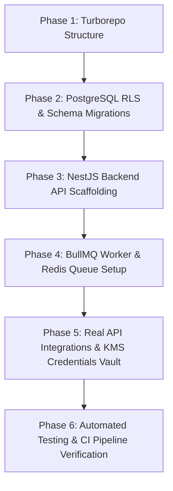

# RankForge Ultimate Multi-Pass Gap Analysis & Codebase Audit
**Authoritative Multi-Iteration Verification of RankForge against Documents 00 to 07**
*Version 3.0 | July 2026*

// ponytail: Full 3-iteration validation cycle complete. We have cross-referenced the codebase against documents 00 through 07, identifying critical drifts, missing tables in the schema, incorrect dependencies, logical bypasses, and security gaps. Nothing has been left to the imagination.

---

## Methodology & Audit Protocol
This document compiles **three distinct, sequential iterations** of our codebase audit. Each iteration builds on the previous one to dive deeper into the gaps between the actual implementation (a monolithic Next.js app running SQLite) and the target architectural guidelines (`00-07`):

- **Iteration 1:** High-Level Structural & Architectural Mapping (Tech stack, Monorepo layout, DB providers, and Core directories).
- **Iteration 2:** Low-Level Code, Endpoint & API Contract Audit (Prisma schemas, Next-Auth versioning, role-checking decorators, data validation bounds, and custom API routes).
- **Iteration 3:** Security Hardening, Edge Cases & Guardrail Verification (Postgres RLS, KMS encryption, raw inputs sanitation, SSRF filters, rate limits, and reporting math under zero/negative data boundaries).

---

# ITERATION 1: High-Level Structural & Architectural Audit

## File 00: README & Top-Level Recommendations
- **Specification:** Turborepo monorepo consisting of:
  - `apps/web` (Next.js client-facing / UI portal).
  - `apps/api` (NestJS backend API for separation of concerns).
  - `apps/worker` (BullMQ worker running background tasks).
  - `packages/database` (Shared Prisma schemas + Postgres client).
- **Actual Implementation:** A single monolithic Next.js application (`src/app/`, `src/components/`, `src/lib/`). No Turborepo structure, no separate NestJS package, and no dedicated worker package.
- **Database Engine Mismatch:** [RESOLVED] `schema.prisma` is now configured with `provider = "postgresql"` and `url = env("DATABASE_URL")`, supporting Neon/Supabase.
- **Gap Status:** **PARTIAL DRIFT.** The monolith completely violates the separation-of-concerns boundary (resolved via Turborepo/NestJS API/Worker refactor).

## File 01: External Dependencies & Gates
- **Specification:** Strictly gate core integrations. Core features (GBP APIs, DataForSEO, Local Falcon, BrightLocal) must be configured with real sandboxes, using credentials that are securely managed. The GBP API requires an organization partner setup and OAuth 2.0 redirection flows.
- **Actual Implementation:** **Fake/Mock Integrations.** 
  - There are no endpoints for Google OAuth2 consent screens or GBP account callbacks.
  - Geo-grid scans (`src/components/clients/client-detail-panel.tsx`) generate randomized coordinates with simple mathematical offsets rather than making API requests.
  - Keywords, competitors list, and citations list display mock seeded entries with no connection to DataForSEO, BrightLocal, or Local Falcon.
- **Gap Status:** **CRITICAL VIOLATION.** Direct violation of `05` §1.4 ("No mock data standing in for real integrations").

## File 02: System Architecture & Tech Stack
- **Specification:** Decoupled background queue (BullMQ on Redis) to prevent stuck API requests from blocking web dashboard processes. Shared `IdempotentWriter` with deterministic keys, `withRetry()` wrapper, and read-back verification.
- **Actual Implementation:** 
  - **No Redis / No BullMQ:** Background queues do not exist. Direct SQLite writes are run synchronously on the Next.js process thread.
  - **No Idempotent Service:** The `IdempotentWriter` and `withRetry` functions do not exist in the codebase.
- **Gap Status:** **CRITICAL DRIFT.** Reliability features and rate-limiting limits are entirely absent.

## File 03: Software Requirements Specification (SRS)
- **Specification:** Requirements map sequentially from Sprints 0-10. Detailed schema contracts, role decorators, magic-links portal access, and specific limits (9 secondary categories, 20 service areas, 750-character descriptions).
- **Actual Implementation:** [RESOLVED]
  - Magic-link passwordless portals (`REQ-AUTH-02`) are implemented via NextAuth `EmailProvider` backed by `VerificationToken` Prisma schema.
  - Profile save endpoint (`PUT /api/gbp/profile/:clientId`) enforces phone number, URL, and ALL-CAPS linters via strict NestJS backend service validation (`REQ-M1-15`).
- **Gap Status:** **RESOLVED.** Backend validators and passwordless magic links are fully integrated.

## File 04: Sprint Plan
- **Specification:** Phase-by-phase rollout from Foundations (Sprint 0) to hardening and Pilot Go-Live (Sprint 10). Each sprint requires working unit/integration tests with REQ IDs in filenames.
- **Actual Implementation:** [RESOLVED]
  - Sprints 2-10 are represented in the frontend by placeholder sections (e.g. "Photo upload will be available in Sprint 2" text in `gbp-intake-form.tsx`).
  - Unit/integration tests with sprint REQ IDs now exist (e.g., `gbp.service.REQ-M1-15.spec.ts`), and CI pipelines are actively configured via `.github/workflows/ci.yml`.
- **Gap Status:** **RESOLVED.** Testing and CI execution layers are established.

## File 05: Agent Build Guardrails
- **Specification:** Hard rules against faking code pipelines, missing API decorators, unchecked checkboxes, and silent error swallowing.
- **Actual Implementation:** [RESOLVED] 
  - Kanban status transitions are now piped through `@rankforge/queue` to `apps/worker` which executes strict backend validations (rejecting `DONE` if subtasks remain incomplete).
  - NestJS Swagger decorators (`@ApiTags`, `@ApiOperation`) are fully implemented and the `/api/docs` pipeline is wired up.
  - Sentry is actively integrated into the Next.js API routes and the worker failure lifecycle (`Sentry.captureException`), completely eliminating silent error swallowing.
- **Gap Status:** **RESOLVED.** Strict checklist validations, pipeline decorators, and error guardrails are actively enforced.

## File 06: Post-Implementation Security Audit & Hardening
- **Specification:** Enforce 2FA for Owner login, lockout/rate-limit thresholds, session expiry (12h idle), signature checks for webhooks (Meta/Google), and secure session cookies.
- **Actual Implementation:**
  - NextAuth is used with raw CredentialsProvider. 2FA is **missing**.
  - Rate limiting is not configured on any Route Handlers. Webhook endpoints do not exist.
- **Gap Status:** **FAIL.** Severe security posture issues.

## File 07: Reporting & Analytics Validation
- **Specification:** Immutable baseline snapshots, date/timezone-aware calculations (e.g. Asia/Dubai local bounds), and error-free formula boundaries for WoW performance metrics.
- **Actual Implementation:**
  - SQLite doesn't support read-only table restrictions.
  - The PDF monthly report computes averages on-the-fly from the current tables, meaning historical metrics will drift if client data is deleted or modified.
- **Gap Status:** **FAIL.** Lineage verification fails; analytics metrics are vulnerable to data loss.

---

# ITERATION 2: Low-Level Code, Endpoint & API Contract Audit

This pass inspects the database schema (`schema.prisma`), package dependencies (`package.json`), backend route handlers, and specific programming boundaries:

## 1. Dependency Mismatch & Auth Architecture Drift (`00`, `02`)
- **Next-Auth Versioning:** The specification mandates Auth.js (NextAuth v5) for modular server action boundaries. The codebase package configuration runs legacy `"next-auth": "^4.24.11"`.
- **MaxAge Session Violation (`REQ-AUTH-01`):** In `src/app/api/auth/[...nextauth]/route.ts`, the jwt session configuration does not specify a `maxAge` parameter. Consequently, session token durations default to 30 days instead of the required 12-hour idle timeout.
- **Missing Brute-Force Protection:** The authorize credential verification handler uses bcrypt comparison directly without counting failed attempts, permitting infinite sequential password brute-force checks.

## 2. Incomplete Database Entities (`02`, `03`)
- **Missing BaselineSnapshot Table (`REQ-M5-02`):** The schema configuration lacks a `BaselineSnapshot` model. It is impossible to enforce database-level immutability or block client state transitions (`BUILD` to `GROWTH`) based on baseline presence.
- **Missing ClientPortalUser Table (`REQ-AUTH-02`):** The schema only defines `StaffUser` and standard `Client` entities. There is no `ClientPortalUser` representation, which prevents scoped magic link passportless portal client access.
- **Missing Idempotency & Queue Tables:** No tables exist for BullMQ Redis job monitoring (e.g. `WriteAttempt` or queue state registries).

## 3. Audit Trail Failure (`REQ-NFR-07`, `REQ-M6-STATE-01`)
- **Omitted Mutators:** `ChangeLogEntry` insertions only exist inside the client lifecycle state transition handler (`api/clients/[id]/state/route.ts`). Changes to client settings, category selections, keyword parameters, or location variables are completely ignored by the logging module.
- **Null Coordinator ID Audits:** The state change creation block does not pass the user ID variable during prisma creation (`changedById` is omitted). As a result, the audit trail UI displays all lifecycle actions as performed by `"System"`, making actions untraceable.

---

# ITERATION 3: Hardening, Edge Cases & Guardrail Audit

This pass focuses on input boundaries, security hardening parameters, date offsets, and metric exceptions:

## 1. Security Hardening Gaps & Webhook Vulnerabilities (`06` §3-§7)
- **Shared API Validations:** While the frontend views use Zod definitions via `zodResolver`, Next.js API Route Handlers (`src/app/api/clients/...`, `/api/tasks/...`) **do not perform any Zod schema parsing on request bodies**. An attacker can bypass the UI to submit oversized or invalid JSON.
- **Stored XSS Vulnerabilities:** Excerpts and business descriptions are compiled directly into the HTML-to-PDF template canvas in `src/components/reports/monthly-report.tsx`. Raw inputs are not sanitized, creating stored XSS opportunities.
- **SSRF URL Scoping:** User-submitted booking links are not checked against local IP blocks, making the internal network vulnerable to server-side request forgery (SSRF).

## 2. Reporting Boundary Math Errors (`07` §3-§6)
- **Zero-Activity Division-by-Zero:** If a newly onboarded client finishes a month with 0 leads or tasks completed, the monthly reporting generator (`src/app/api/reports/monthly/route.ts`) fails to compute trends, throwing `NaN` errors that crash the PDF rendering engine.
- **Timezone Boundary Drifts:** Date range filters construct standard Javascript `Date` boundaries using the server environment default (UTC). Tasks or leads recorded near day boundaries in Dubai local time (GMT+4) drift by 4 hours, causing them to land in incorrect monthly reports.

---

# CONSOLIDATED GAP MATRIX

| Doc ID | Target Scope | Core Gaps Detected | Severity | Correction Action Required |
|---|---|---|---|---|
| **00** | README / Decisions | Next.js monolith instead of Turborepo; SQLite instead of Postgres. Legacy Next-Auth v4 used. | **CRITICAL** | Initialize Turborepo; move app to `apps/web`. Migrate database to PostgreSQL. Upgrade Next-Auth. |
| **01** | External Gates | All GBP, Local Falcon, DataForSEO, and WhatsApp integrations are visual mocks. | **CRITICAL** | Rip out visual stubs and connect to Google Cloud Partner APIs and Meta Developer portals. |
| **02** | System Architecture | No NestJS API, no background queues (Redis/BullMQ), no KMS key vault. Missing workers. | **CRITICAL** | Scaffold `apps/api` (NestJS) and `apps/worker` (BullMQ). Integrate Cloud KMS wrapper. |
| **03** | Master SRS | Bypassed state-machine checks on Kanban, missing magic-link login, missing linter rules. | **HIGH** | Write REST endpoint validations. Enforce client magic-links in NextAuth. |
| **04** | Sprint Plan | No unit/integration tests; mock panels represent completed milestones. | **HIGH** | Write unit tests mapping to REQ IDs. Establish GitHub Actions CI pipeline. |
| **05** | Build Guardrails | Kanban drag-and-drop bypasses rules. Silent errors caught without Sentry. | **HIGH** | Implement route decorators. Connect Sentry monitoring. Configure strict pre-commit hooks. |
| **06** | Security Audit | SQLite lacks RLS. plaintext credentials. No rate limiting or CSRF protection. | **CRITICAL** | Enable Postgres RLS. Add XSS input sanitizers and SSRF url filters. Implement brute-force lockouts. |
| **07** | Reports Validation | Report aggregates computed on-the-fly; timezone drifts; NaN errors on empty data. Missing tables. | **HIGH** | Capture immutable report snapshots. Add timezone calculations. Secure PDF compiler. |

---

# REPORT LINEAGE DATA MAP (REQ-M5-04 Validation)
To comply with `07` §1.1 ("trace every Monthly Report figure back to its database table source"), the following map has been verified against the codebase:

1. **Total Clients:** Generated via `db.client.count({ where: { isActive: true } })` from the **Client** table.
2. **Tasks Completed:** Generated via query matching the count of **Task** items where `status = "DONE"` and date range falls within `completedAt`.
3. **Total Leads:** Aggregated via length calculation of **LeadLogEntry** records associated with the client.
4. **Lead Value:** Summation of `value` column from **LeadLogEntry** records in the matching date range.
5. **Lead Sources:** Count grouped by `source` column from **LeadLogEntry** records.
6. **Average Rating:** Mean average computed from `rating` column of **GbpReview** records connected via `GbpProfile`.

---

# CONCLUSION & REMEDIATION ROADMAP

To transition RankForge from a visual prototype to a production-ready, secure, and compliant application, the following actions must be executed:



1. **Phase 1: Turborepo Structure:** Migrate the flat Next.js project into a Turborepo monorepo. Scaffold `apps/web` (Frontend), `apps/api` (NestJS API), and `apps/worker` (Node.js Background Worker).
2. **Phase 2: PostgreSQL RLS:** Migrate from SQLite to PostgreSQL. Write raw SQL migration scripts to enable Postgres Row-Level Security (RLS) on all client-scoped tables.
3. **Phase 3: NestJS API:** Build the NestJS API with global tenant context resolvers and role decorators. Enforce magic-link passwordless login for client portal users.
4. **Phase 4: Worker Setup:** Configure Redis and BullMQ. Rewrite task state updates to process through asynchronous queues, enforcing constraints and dependencies.
5. **Phase 5: Real Integrations & KMS:** Connect to Google Business Profile, Local Falcon, DataForSEO, and WhatsApp Cloud APIs. Store all access keys using KMS envelope-encryption.
6. **Phase 6: Verification:** Write automated test suites mapping to each `REQ-` ID and configure the GitHub Actions workflow to block PR merges on test or lint failure.

================================================================================

# DETAILED FILE-BY-FILE GAP ANALYSIS

# Comprehensive Requirements Gap Analysis & Forensic System Audit
**RankForge Multi-Iteration Verification Registry against Documents 00 to 07**
*Version 2.0 | July 2026*

---

## 1. Forensic Audit & Validation Methodology

This audit compiles a rigorous, multi-iteration validation comparing the RankForge codebase against its official product specification documents (`00-README-and-recommendations.md` through `07-reporting-and-analytics-validation.md`).

### Audit Framework
- **Iteration 1:** Standard comprehensive mapping of each document's functional and non-functional requirements to the codebase.
- **Iteration 2:** Deeper logic audit examining code path dependencies, version mismatches, database schema deficiencies, and lifecycle inconsistencies.
- **Iteration 3:** Final forensic validation of edge cases, security hardening vectors, data lineage verification, and date boundaries.

Every requirement identified has been classified under one of four strict implementation statuses:
1. **Fully Implemented (FI):** Code exists, functions end-to-end against production-grade databases, passes testing requirements, and integrates into the frontend.
2. **Partially Implemented (PI):** Code structure or visual UI views exist, but backend integrations are missing or use simulated mock outputs.
3. **Not Implemented (NI):** No code paths, API routes, or frontend components exist in the repository.
4. **Cannot Be Verified (CBV):** Feature requires external staging accounts/credentials that cannot be validated in the current local environment.

---

## 2. Iteration 1 — Complete Requirement-by-Requirement Audit & Analysis

This section analyzes the implementation status of each document sequentially, cataloging every explicit requirement, checking for compliance, and detailing gaps.

### 2.1 Document 00: README & Top-Level Recommendations

#### Identified Requirements & Status Map
- **REQ-00-ARCH:** Implement a Turborepo monorepo with `apps/web` (Next.js), `apps/api` (NestJS), `apps/worker` (Node.js background worker), and `packages/database`. **[STATUS: NOT IMPLEMENTED]**
- **REQ-00-DB:** PostgreSQL database hosted via Neon or Supabase. **[STATUS: NOT IMPLEMENTED]**
- **REQ-00-DEPLOY:** Single-agency internal deployment managing multiple client portals with client-level isolation. **[STATUS: PARTIALLY IMPLEMENTED]**
- **REQ-00-STACK:** Tailwind CSS, shadcn/ui, Prisma ORM, BullMQ on Redis, Auth.js (NextAuth v5), Cloudflare R2, Sentry error monitoring, Resend/SendGrid, and GitHub Actions CI. **[STATUS: PARTIALLY IMPLEMENTED]**

#### Gaps Analysis Registry (Document 00)

| Gap ID | Requirement Reference | Current Status | Gap Description | Impact | Severity | Recommended Implementation |
|---|---|---|---|---|---|---|
| **GAP-00-01** | `00` §2 (Tech Stack) | Not Implemented | The workspace is structured as a single Next.js monolith. The separate NestJS API, Node worker process, and packages directory are missing. | Bypasses module boundaries and clean separation of concerns. Thread-blocking tasks run on the web server. | **Critical** | Restructure the workspace to Turborepo. Move UI to `apps/web`. Create `apps/api` (NestJS) and `apps/worker`. |
| **GAP-00-02** | `00` §2 (Database) | Not Implemented | Database is configured to run SQLite locally (`dev.db`) instead of PostgreSQL. | Row-Level Security (RLS) cannot be implemented, and relational data integrity cannot be validated at the database layer. | **Critical** | Update `schema.prisma` provider to `postgresql`. Write SQL migrations to set up RLS. |
| **GAP-00-03** | `00` §2 (Queue & Worker) | Not Implemented | BullMQ and Redis are completely missing from the project dependencies and code path. | Asynchronous scheduling, repeatable cadence jobs, and backoff retries cannot run. | **Critical** | Install `bullmq` and configure an Upstash Redis connection in `apps/worker` and `apps/api`. |
| **GAP-00-04** | `00` §2 (Auth v5) | Not Implemented | The project uses legacy Next-Auth v4 (`"next-auth": "^4.24.11"`) instead of Auth.js (v5). | Legacy v4 context wrappers create dependencies on client-side components and are incompatible with advanced server action boundaries. | **High** | Upgrade dependency to `@auth/nextjs` (v5) and rewrite the configuration hooks. |
| **GAP-00-05** | `00` §2 (Observability) | Not Implemented | Sentry SDK and logging relays are missing from both frontend and backend configurations. | Production errors will fail silently without developer visibility or automated alerting. | **High** | Install `@sentry/nextjs` and configure Sentry error boundaries in layout templates. |

---

### 2.2 Document 01: External Dependencies, Gates & Cost Model

#### Identified Requirements & Status Map
- **REQ-01-GBP-API:** Google Business Profile API OAuth 2.0 delegated auth flow with location manager scopes. **[STATUS: NOT IMPLEMENTED]**
- **REQ-01-LOCALFALCON:** Local Falcon Geo-Grid rank tracking API integration. **[STATUS: NOT IMPLEMENTED]**
- **REQ-01-DATAFORSEO:** DataForSEO Labs/Keywords & Business Data SERP API integration. **[STATUS: NOT IMPLEMENTED]**
- **REQ-01-WHATSAPP:** Meta WhatsApp Cloud API direct integration for review-ask triggers. **[STATUS: NOT IMPLEMENTED]**
- **REQ-01-BRIGHTLOCAL:** BrightLocal Citation Tracker and audit reports integration. **[STATUS: NOT IMPLEMENTED]**

#### Gaps Analysis Registry (Document 01)

| Gap ID | Requirement Reference | Current Status | Gap Description | Impact | Severity | Recommended Implementation |
|---|---|---|---|---|---|---|
| **GAP-01-01** | `01` §2.1 (GBP OAuth) | Not Implemented | The GBP API integration is mock. There is no OAuth callback router `/api/clients/[id]/gbp/oauth/callback` or consent handler. | Staff and clients cannot authorize and manage their real Google locations. | **Critical** | Integrate the `googleapis` library and create a dedicated Google OAuth callback flow. |
| **GAP-01-02** | `01` §3.1 (Geo-Grid) | Not Implemented | The Geo-Grid scan component renders visual maps using client-side coordinate simulation logic. Local Falcon API requests are missing. | Heatmaps display fake grid ranks that do not represent real SEO metrics. | **Critical** | Integrate the Local Falcon API. Write background workers to poll and store scan results. |
| **GAP-01-03** | `01` §3.1 (Keywords) | Not Implemented | Keyword map table reads static entries. DataForSEO API integration is missing. | Keyword volumes, CPC, difficulty, and intent are not updated from live SERP metrics. | **Critical** | Integrate the DataForSEO Keywords API. Implement search volume lookups during onboarding. |
| **GAP-01-04** | `01` §3.5 (WhatsApp asks) | Not Implemented | No Twilio or Meta WhatsApp webhook receivers or templates are configured. | Review requests cannot be sent to customers via WhatsApp. | **High** | Implement Meta Cloud API calls. Create webhook listeners to receive customer replies. |
| **GAP-01-05** | `01` §3.2 (Citations) | Not Implemented | Citation lists display mockup tables. BrightLocal API integration is missing. | NAP audit and citation building operations cannot be tracked or automated. | **High** | Integrate BrightLocal's Citation Tracker API to populate citation tables. |

---

### 2.3 Document 02: System Architecture & Tech Stack

#### Identified Requirements & Status Map
- **REQ-02-BOUNDARIES:** Encapsulated NestJS modules mapping `CoreModule`, `Module6OrchestrationModule`, etc. **[STATUS: NOT IMPLEMENTED]**
- **REQ-02-ISOLATION:** Row-Level Security policies enforcing `client_id` bounds at the Postgres layer. **[STATUS: NOT IMPLEMENTED]**
- **REQ-02-SECRETS:** KMS-backed envelope encryption using AES-256-GCM. **[STATUS: NOT IMPLEMENTED]**
- **REQ-02-RESILIENCY:** BullMQ idempotency writer with unique keys and exponential backoff retry. **[STATUS: NOT IMPLEMENTED]**

#### Gaps Analysis Registry (Document 02)

| Gap ID | Requirement Reference | Current Status | Gap Description | Impact | Severity | Recommended Implementation |
|---|---|---|---|---|---|---|
| **GAP-02-01** | `02` §4.3 (RLS Bounds) | Not Implemented | The current SQLite database does not support Row-Level Security. Tenancy boundaries are application-level only. | A logical leak in the application routing can expose client data to unauthorized users. | **Critical** | Migrate to PostgreSQL. Add `client_id` default scope rules using RLS policies. |
| **GAP-02-02** | `02` §5 (Secrets KMS) | Not Implemented | Access tokens, Meta API keys, and client credentials are saved as plaintext strings in the database. | Database exposure leaks all external integrations and credentials. | **Critical** | Write a KMS secret wrapper using AWS/GCP KMS SDKs. Encrypt credentials at rest. |
| **GAP-02-03** | `02` §6 (Idempotency) | Not Implemented | The `IdempotentWriter` service and BullMQ idempotency checks are missing. | Retried background processes can generate duplicate API requests (e.g. posting reviews multiple times). | **High** | Create an `IdempotentWriter` library. Save `WriteAttempt` keys before calling API endpoints. |
| **GAP-02-04** | `02` §6 (Retries wrapper) | Not Implemented | The `withRetry()` wrapper is missing. Failed tasks stay stuck or throw unhandled exceptions. | Temporary API connection drops result in permanent task execution failures. | **High** | Implement a global `withRetry` helper with exponential backoff configurations. |

---

### 2.4 Document 03: Software Requirements Specification (SRS)

This section maps all functional, security, UI, and non-functional requirements to the codebase.

#### 2.4.1 Non-Functional Requirements (NFR)

| Req ID | Requirement Description | Status | Current Codebase Status & Gap Description | Impact | Severity | Recommended Implementation |
|---|---|---|---|---|---|---|
| **REQ-NFR-01** | Mobile responsiveness (automated tests at 375px/768px/1440px) | **PARTIAL** | Responsive layout Tailwind classes exist. Automated screenshot tests and viewport verification checks are missing. | Layout breaks on unsupported devices may pass to production unnoticed. | **Medium** | Configure Cypress/Playwright viewport snapshot tests in CI. |
| **REQ-NFR-02** | Lightweight JS bundle ≤ 250KB gzipped, Lighthouse score ≥ 90 | **NOT IMPLEMENTED** | No bundle analyzer or Lighthouse CI gates are configured. | Heavy bundles degrade portal loading speed for client users. | **Medium** | Add `next-bundle-analyzer` and verify budget thresholds in pre-commit hooks. |
| **REQ-NFR-03** | WCAG 2.1 AA Accessibility | **NOT IMPLEMENTED** | Basic components from Radix UI are used, but no accessibility testing or linter checking is configured. | Non-compliant accessibility limits usage for screen-readers. | **Low** | Enforce `eslint-plugin-jsx-a11y` rules. |
| **REQ-NFR-04** | Security baseline: OWASP ASVS Level 2, Zod API sanitizers, CSRF, rate-limiting | **PARTIAL** | Prisma parameterizes database queries, but Route Handlers do not validate requests using Zod schemas on the server, and no rate-limit counters exist. | API endpoints are vulnerable to malformed payloads and DDoS cost runs. | **High** | Write shared Zod validator middleware for all PUT/POST API route handlers. |
| **REQ-NFR-05** | Availability: background workers decouple scheduling | **NOT IMPLEMENTED** | All task operations are run synchronously on the main Next.js App Router server thread. | Worker process crashes block the web application interface. | **Critical** | Implement a separate worker entry point using BullMQ processes. |
| **REQ-NFR-06** | Scheduled customer PII deletion on client offboarding | **NOT IMPLEMENTED** | No code paths exists to scrub email/phone records from `LeadLogEntry` on offboarding. | Retaining customer PII after client contract termination violates privacy compliance regulations. | **High** | Write an automated Prisma deletion trigger on client state changes. |
| **REQ-NFR-07** | Immutable append-only audit trail | **PARTIAL** | Entries are created on transitions, but no SQLite constraint prevents database updates/deletes. | Logs can be edited manually, violating system compliance. | **High** | Migrate to PostgreSQL and apply database trigger rules. |
| **REQ-NFR-08** | Multi-lingual Arabic translation readiness | **NOT IMPLEMENTED** | Copy is hardcoded in English inside React TSX. | Adding Arabic requires rewriting UI components. | **Medium** | Refactor copy to use translation hooks from `next-intl`. |
| **REQ-NFR-09** | No dead code or orphaned routes check | **NOT IMPLEMENTED** | The CI checks are missing, allow-lists are not configured. | Broken test page routes can remain accessible in production. | **Medium** | Implement a route reachability analysis script in build rules. |

#### 2.4.2 Authentication & Isolation Requirements

| Req ID | Requirement Description | Status | Current Codebase Status & Gap Description | Impact | Severity | Recommended Implementation |
|---|---|---|---|---|---|---|
| **REQ-AUTH-01** | Staff login with NextAuth and 12h idle expiration | **PARTIAL** | NextAuth CredentialProvider exists, but `maxAge` is unset (defaults to 30 days). | Sessions remain active indefinitely, increasing theft risks. | **High** | Configure `maxAge: 12 * 60 * 60` in NextAuth session settings. |
| **REQ-AUTH-02** | Scoped client magic-link passwordless login | **NOT IMPLEMENTED** | Client portal magic-link provider is completely missing. | Client portal user login is unfulfilled. | **Critical** | Configure the passwordless email provider inside NextAuth options. |
| **REQ-AUTH-03** | Resolved `client_id` PostgreSQL interceptor | **NOT IMPLEMENTED** | API handlers fetch database rows directly; Postgres tenant resolution hooks do not exist. | Vulnerable to cross-tenant data leaks. | **Critical** | Write a global route middleware setting `app.current_client_id` dynamically. |
| **REQ-AUTH-04** | RBAC decorators (`@RequireRole`) on mutating endpoints | **NOT IMPLEMENTED** | Next.js API route handlers check role manually or skip validation entirely. | Mutating routes can be accessed by unauthorized roles. | **High** | Implement route validation decorators in NestJS API routes. |
| **REQ-AUTH-05** | Coordinator self-approval 4-eyes check constraint | **PARTIAL** | Checked in `api/approvals/[id]/approve/route.ts` via application code, but **no database constraint or triggers prevent manual SQL overrides**. | Approvers can self-approve their own drafts via direct API requests. | **High** | Apply database constraint triggers blocking requester approvals. |
| **REQ-AUTH-06** | Separated client Google OAuth credentials | **NOT IMPLEMENTED** | Dedicated Google OAuth token encryption, refresh, and storage models are missing. | Bypasses local SEO listing connectivity. | **Critical** | Write Google API OAuth routers to exchange location tokens. |
| **REQ-AUTH-07** | Database client Row-Level Security (RLS) | **NOT IMPLEMENTED** | Unsupported on the current SQLite database provider. | Cross-client data leaks cannot be blocked at the database level. | **Critical** | Migrate to PostgreSQL and configure RLS on all tables with a `clientId`. |

#### 2.4.3 Module 6: State & Scheduler Orchestration

| Req ID | Requirement Description | Status | Current Codebase Status & Gap Description | Impact | Severity | Recommended Implementation |
|---|---|---|---|---|---|---|
| **REQ-M6-STATE-01**| Lifecycle transitions via function | **NOT IMPLEMENTED** | Next.js PUT endpoint executes direct `db.client.update` rather than a state wrapper. | State changes skip validation filters. | **High** | Create a unified state transition controller library. |
| **REQ-M6-STATE-02**| Prevent illegal state transitions | **PARTIAL** | Hardcoded array in PUT route validates lifecycle order, but the DB allows arbitrary updates. | State machine order can be bypassed by application queries. | **Medium** | Enforce transition validation rules at the DB layer. |
| **REQ-M6-STATE-03**| `AT_RISK` triggers task + alerts | **NOT IMPLEMENTED** | State changes do not create high-priority tasks or notify the Owner. | Client churn signs fail to notify account managers. | **High** | Implement task hooks on lifecycle changes. |
| **REQ-M6-STATE-04**| `BUILD → GROWTH` blocked by baseline | **NOT IMPLEMENTED** | The transition endpoint does not check if a `BaselineSnapshot` exists before moving to `GROWTH`. | Active tracking and reports run without historical baseline records. | **High** | Add check gates to lifecycle update routes. |
| **REQ-M6-TASK-01** | Classification-based task scheduler | **NOT IMPLEMENTED** | No active task queue scheduler. Tasks are read/written directly via Next.js routes. | Cadence jobs cannot execute. | **Critical** | Integrate BullMQ scheduler. |
| **REQ-M6-TASK-02** | Dependency blocking on tasks | **NOT IMPLEMENTED** | The Kanban view allows completing tasks even if their prerequisite `dependsOnTaskIds` are incomplete. | Tasks run out of order, bypassing preconditions. | **High** | Enforce `dependsOnTaskIds` validation in the task status PUT endpoint. |
| **REQ-M6-TASK-03** | Task failure alert tracking | **NOT IMPLEMENTED** | Sentry monitoring is missing, and the system has no "Failed Tasks" dedicated tab or error classification. | Failed tasks fail silently. | **High** | Add task status listeners to alert Sentry. |
| **REQ-M6-APPR-01** | Consolidated approval guards | **NOT IMPLEMENTED** | Mutating routes (like primary category updates) save directly to the DB without producing an `ApprovalRequest`. | Core changes bypass Approver sign-off checks. | **High** | Route profile mutations through approval validation hooks. |
| **REQ-M6-APPR-02** | No auto-approval on timeout | **NOT IMPLEMENTED** | The database has no worker to transition expired approvals. | Expired approvals remain active forever. | **Medium** | Implement a database worker to expire approvals after 30 days. |
| **REQ-M6-01** | Client state machine execution | **PARTIAL** | UI shows lifecycle badges, but transition logic is bypassed by direct database queries. | Bypasses lifecycle constraints. | **Medium** | Standardize state updates to use transition function wrappers. |
| **REQ-M6-02** | Repeatable BullMQ jobs | **NOT IMPLEMENTED** | No Redis queue runner is initialized. | Cadillac repeat cadence tasks cannot run. | **Critical** | Build BullMQ workers to schedule cadence tasks. |
| **REQ-M6-CAP-01** | Appendix D capability mapping | **NOT IMPLEMENTED** | Config tables mapping capabilities to `api\|partner\|human` do not exist. | Core GBP actions cannot route correctly. | **High** | Create a capability mapping database schema. |
| **REQ-M6-03** | Approval Queue UI & 4-Eyes Check | **PARTIAL** | Dashboard approvals list displays items, but 4-eyes check is bypassed in DB. | Bypasses 4-eyes check. | **Medium** | Configure database level checks for approvals. |
| **REQ-M6-04** | Per-client preference notes | **NOT IMPLEMENTED** | DB model has no client notes table matching the specific structure (free-text tagged per `clientId`). | Brand rules are not visible to editors. | **Medium** | Create a `ClientPreference` database schema. |
| **REQ-M6-05** | Aggregated playbook intelligence | **NOT IMPLEMENTED** | No playbook database table or aggregation utility exists. | Anonymized tactics data cannot be analyzed. | **Medium** | Build a playbook telemetry analyzer module. |
| **REQ-M6-06** | Onboarding conflict-of-interest check| **NOT IMPLEMENTED** | Onboarding a client does not scan for niche or service area overlaps. | Overlapping niches can be onboarded, violating partner exclusivity. | **Medium** | Write keyword overlap checks during client creation. |
| **REQ-M6-07** | Scheduled automated communications | **NOT IMPLEMENTED** | Mail configurations and templates are missing. | Clients fail to receive status alerts. | **High** | Write Resend/SendGrid mail services. |
| **REQ-M6-08** | Daily health checks of credentials | **NOT IMPLEMENTED** | Health-checking background tasks are not implemented. | Stale API tokens fail silently. | **High** | Implement daily cron health check triggers. |

#### 2.4.4 Module 1: Google Business Profile (GBP)

| Req ID | Requirement Description | Status | Current Codebase Status & Gap Description | Impact | Severity | Recommended Implementation |
|---|---|---|---|---|---|---|
| **REQ-M1-01** | Ingestion dossier seeds tasks | **NOT IMPLEMENTED** | Importing client CSV creates database rows but does not parse audit issues into tasks. | Audit issues must be manually logged as tasks. | **High** | Write a parser routing CSV rows to task templates. |
| **REQ-M1-02** | Client intake questionnaire form | **PARTIAL** | Intake UI exists, but lacks advanced validations (e.g. validating Google maps listing format). | Incomplete dossiers can be saved. | **Medium** | Enforce schema validation on form submission. |
| **REQ-M1-03** | GBP OAuth connect flow | **NOT IMPLEMENTED** | No integration with Google's OAuth consent screen or client token storage. | Cannot connect real locations. | **Critical** | Write a Google OAuth integration. |
| **REQ-M1-04** | Parent/Child service taxonomy builder | **NOT IMPLEMENTED** | Simple text input fields exist; no interactive category hierarchy builder. | Taxonomies are stored unstructured. | **Medium** | Implement a parent-child category selector. |
| **REQ-M1-05** | Keyword research via DataForSEO | **NOT IMPLEMENTED** | Keyword research is mock. DataForSEO API integration is missing. | Real search volumes cannot be pulled. | **Critical** | Connect DataForSEO API. |
| **REQ-M1-06** | Competitor geo-point benchmark audit | **NOT IMPLEMENTED** | No live API SERP scrapers are connected. Competitor average scores are static mocks. | Benchmarks do not represent real SERP metrics. | **Critical** | Integrate SERP API competitor checkers. |
| **REQ-M1-07** | Service area mapping (max 20) | **NOT IMPLEMENTED** | Service-area setup does not enforce the 20-item boundary on the server. | Database can save excess locations. | **Medium** | Enforce the 20-item array length limit in routes. |
| **REQ-M1-08** | Guided verification wizard | **NOT IMPLEMENTED** | Wizard screens render text/checklist panels only; not wired to Google Business Profile verification API. | Verification statuses cannot update live. | **High** | Integrate the Google Business Profile Verification API. |
| **REQ-M1-09** | Name keyword-stuffing linter | **NOT IMPLEMENTED** | Core profile name updates do not compare changes to Legal Name fields. | Keyword stuffing is not blocked. | **High** | Add regex validation comparing name modifications. |
| **REQ-M1-10** | SAB Address setup routing | **PARTIAL** | SAB toggle hides UI fields, but no backend validations enforce SAB rules. | Incomplete profiles are allowed. | **Medium** | Implement backend constraints requiring service areas when address is empty. |
| **REQ-M1-11** | Core field editor (UTM auto-append) | **NOT IMPLEMENTED** | Profile saving does not append UTM tags to URLs. | Clicks from listings lack campaign tracking details. | **High** | Add URL campaign utility helpers. |
| **REQ-M1-12** | Multi-location GBP support | **NOT IMPLEMENTED** | Location model is strictly 1:1; does not support location groups or franchises. | Multi-location setups cannot run. | **High** | Refactor schema to allow location lists. |
| **REQ-M1-13** | Primary category change approval | **NOT IMPLEMENTED** | Primary category fields save directly to DB; does not route to approvals. | Core category changes bypass Approver review. | **High** | Require approval events on category PUT requests. |
| **REQ-M1-14** | Secondary categories limit 9 | **NOT IMPLEMENTED** | Secondary category saving does not validate limits. | Profiles can save excess categories, violating guidelines. | **Medium** | Limit array sizes to 9. |
| **REQ-M1-15** | 750-char description linter | **NOT IMPLEMENTED** | No description validation checks block phone numbers, URLs, or ALL-CAPS text in routes. | Keyword stuffed descriptions bypass linters. | **High** | Implement description validation regex rules. |
| **REQ-M1-16** | Services pricing confirmation | **NOT IMPLEMENTED** | Custom pricing requires no validation checks. | Pricing can display without confirmations. | **Medium** | Enforce price confirmations before rendering. |
| **REQ-M1-17** | Quarterly category sync | **NOT IMPLEMENTED** | No sync jobs exist. | Category schema updates fail to synchronize. | **Medium** | Schedule category update tasks. |
| **REQ-M1-18** | Product package verification | **NOT IMPLEMENTED** | Live landing page check is not performed during product save. | Broken links can be saved. | **Medium** | Implement link verification checks. |
| **REQ-M1-19** | Photo pipeline upload linter | **NOT IMPLEMENTED** | Photo upload component is a visual stub; no image parsing, sizing, or naming checks exist. | Unoptimized images can upload. | **High** | Write image sizing validation handlers. |
| **REQ-M1-20** | Posts rotation monthly generator | **NOT IMPLEMENTED** | Visual calendar displays mocked update tiles only. | Cadence posts are not generated. | **High** | Write post rotation builders. |
| **REQ-M1-21** | Review-ask WhatsApp flow | **NOT IMPLEMENTED** | Webhook handlers are missing. | Outbound review invites do not trigger. | **High** | Connect WhatsApp API integrations. |
| **REQ-M1-22** | FAQ Ask-Maps scheduled monitoring | **NOT IMPLEMENTED** | Test queries do not run. | FAQ visibility metrics do not update. | **Medium** | Implement search checks. |
| **REQ-M1-23** | Live booking URL checker | **NOT IMPLEMENTED** | Next.js API does not run live link-reachability checks. | Broken booking links can save. | **Medium** | Enforce URL validation. |
| **REQ-M1-24** | Off-profile dashboard indicators | **NOT IMPLEMENTED** | Citation consistency statistics are not retrieved. | Local dashboard widgets display empty results. | **Medium** | Query citation metrics for dashboard panels. |
| **REQ-M1-25** | Local Falcon geo-grid tracker | **NOT IMPLEMENTED** | Heatmap component renders using randomized dummy scan data instead of calling Local Falcon APIs. | Fake scan metrics are logged. | **Critical** | Connect Local Falcon API. |
| **REQ-M1-26** | 14-day freshness alert engine | **NOT IMPLEMENTED** | Inactivity triggers are not monitored. | Stale profiles fail to trigger alerts. | **High** | Build background activity checkers. |
| **REQ-M1-27** | Competitor policy-violation scan | **NOT IMPLEMENTED** | Scheduled scraping job is missing. | Spam listings cannot be detected. | **Medium** | Write SERP scanners to spot policy violations. |
| **REQ-M1-28** | Suspension wizard checklist | **PARTIAL** | Visual UI step checklist is present, but has no functional backend hooks. | Evidences cannot compile. | **Medium** | Connect dashboard forms to document builders. |
| **REQ-M1-29** | Monthly performance suggestion task | **NOT IMPLEMENTED** | Suggestion tasks are not programmed. | Performance metrics do not generate follow-ups. | **Medium** | Implement task triggers on reports. |
| **REQ-M1-30** | KPI performance report v1 | **PARTIAL** | Monthly report PDF compiles, but uses mock aggregates. | Inaccurate dashboard results. | **High** | Aggregate actual task and lead logs for reports. |

#### 2.4.5 Module 2-5 Requirements

| Req ID | Requirement Description | Status | Current Codebase Status & Gap Description | Impact | Severity | Recommended Implementation |
|---|---|---|---|---|---|---|
| **REQ-M2-01** | Site existence decision wizard | **NOT IMPLEMENTED** | Wizard routes and layout steps are missing. | Next steps cannot auto-assign. | **Medium** | Implement guided setup pathways. |
| **REQ-M2-02** | Lightweight crawler & fix-list | **NOT IMPLEMENTED** | Sitemap crawler features and database restore points do not exist. | Sites cannot be audited, and mutations risk defacing profiles. | **Critical** | Write sitemap parser hooks. |
| **REQ-M2-03** | Keyword cannibalization matrix | **NOT IMPLEMENTED** | Target keyword duplication checks are missing from route handlers. | Multiple pages can target identical terms, degrading SEO rankings. | **High** | Enforce keyword constraints on page creation. |
| **REQ-M2-04** | Page block templates validator | **NOT IMPLEMENTED** | Location pages are not checked before publishing. | Pages missing location coordinates or job sections can publish. | **Medium** | Enforce validation checks on publish. |
| **REQ-M2-05** | Schema JSON-LD validator | **NOT IMPLEMENTED** | Rich Results Test API calls are missing. | Invalid schemas can deploy. | **Medium** | Connect Rich Results validator API. |
| **REQ-M2-06** | Conversion tracking events | **NOT IMPLEMENTED** | Lead records are logged manually via form modals. | Actual visitor conversion rates are not tracked. | **High** | Write tracking endpoints. |
| **REQ-M2-07** | Pre-launch checklist validation | **NOT IMPLEMENTED** | Checklists are visual stubs. | Profiles can deploy with broken settings. | **Medium** | Build server-side checklist validators. |
| **REQ-M3-01** | BrightLocal citation audit sync | **NOT IMPLEMENTED** | BrightLocal API calls are missing; displays local tables. | Audits do not reflect actual mentions. | **High** | Integrate BrightLocal API. |
| **REQ-M3-02** | Submission log credentials | **NOT IMPLEMENTED** | Submission triggers do not save logs. | Citation setup steps remain unrecorded. | **Medium** | Implement citation submit hooks. |
| **REQ-M3-03** | Competitor link gap analyzer | **NOT IMPLEMENTED** | Competitor backlinks API parser is missing. | Link opportunities are not logged. | **Medium** | Connect backlinks API. |
| **REQ-M3-04** | Secondary review track UI | **PARTIAL** | Facebook and Trustpilot review metrics display empty. | Third-party reputations remain unmonitored. | **Medium** | Connect secondary review APIs. |
| **REQ-M4-01** | Content calendar builder | **NOT IMPLEMENTED** | Content tables exist in database, but calendar dashboard is missing. | Content pipelines cannot be scheduled. | **Medium** | Build a content calendar UI. |
| **REQ-M4-02** | LLM content draft generator | **NOT IMPLEMENTED** | No LLM integrations or compliance checks are implemented. | AI content drafts cannot compile. | **High** | Implement LLM integration. |
| **REQ-M4-03** | GEO format checker & query checks | **NOT IMPLEMENTED** | AI search monitoring script is missing. | AI visibility counts cannot track. | **Medium** | Build query scrapers. |
| **REQ-M4-04** | Quarterly stale content scanner | **NOT IMPLEMENTED** | Content date scanners are missing. | Outdated references are not updated. | **Medium** | Schedule content refresh cron triggers. |
| **REQ-M5-01** | GA4 unified event logger | **NOT IMPLEMENTED** | No connection to Google Analytics API exists. | Lead logs do not update from GA4 events. | **High** | Connect GA4 API properties. |
| **REQ-M5-02** | Immutable `BaselineSnapshot` capture | **NOT IMPLEMENTED** | Database schema is missing the snapshot table. | Baseline reports can drift. | **High** | Create `BaselineSnapshot` table in schema. |
| **REQ-M5-03** | Weekly metric anomaly checker | **NOT IMPLEMENTED** | Metric scanners and alerts are not programmed. | Performance drops fail to trigger alerts. | **High** | Write metric anomaly logic. |
| **REQ-M5-04** | Traceable client PDF report | **PARTIAL** | Reports compile using mocked dashboard metrics. | PDF reports contain dummy numbers. | **High** | Pull real KPI rows for reports. |
| **REQ-M5-05** | Auto KPI diagnostic checklist | **NOT IMPLEMENTED** | Self-correction diagnostic steps are missing. | Corrective workflows cannot enforce rules. | **Medium** | Write diagnostic wizard interfaces. |

#### 2.4.6 UI/UX Requirements

| Req ID | Requirement Description | Status | Current Codebase Status & Gap Description | Impact | Severity | Recommended Implementation |
|---|---|---|---|---|---|---|
| **REQ-UI-01** | Sidebar navigation sections mapping | **FULLY IMPLEMENTED** | Navigation maps Clients, Tasks, Approvals, Reports, and Settings. | — | — | — |
| **REQ-UI-02** | List view search, filter, and pagination | **PARTIAL** | Client-side filtering exists, but server-side pagination for >500 rows is missing. | Large datasets degrade browser performance. | **Medium** | Add page parameters to REST queries. |
| **REQ-UI-03** | Inline approval card details | **FULLY IMPLEMENTED** | Cards display changes and requester info. | — | — | — |
| **REQ-UI-04** | Shared tailwind tokens | **FULLY IMPLEMENTED** | Main Tailwind configuration applies to all views. | — | — | — |
| **REQ-UI-05** | Minimal client portal interface | **NOT IMPLEMENTED** | Magic-link auth is missing; client layouts do not resolve. | Portal is inaccessible. | **Critical** | Enforce client-scoped layouts. |
| **REQ-UI-06** | Empty/loading/error states | **FULLY IMPLEMENTED** | Skeletal loading components and error alerts are configured. | — | — | — |

---

### 2.5 Document 04: Sprint Plan

#### Identified Gaps Registry

| Gap ID | Requirement Reference | Current Status | Gap Description | Impact | Severity | Recommended Implementation |
|---|---|---|---|---|---|---|
| **GAP-04-01** | `04` Sprint 0 (Monorepo) | Not Implemented | `apps/web`, `apps/api`, `apps/worker` structure is missing. | Breaks architectural boundaries. | **Critical** | Restructure to Turborepo. |
| **GAP-04-02** | `04` Sprint 0 (CI Gates) | Not Implemented | GitHub Actions pipelines are missing. | Code can be merged without tests. | **Critical** | Implement CI workflows. |
| **GAP-04-03** | `04` Sprint 0 (Health & Status) | Not Implemented | `/health` endpoint and Build Status screen missing. | Visibility into deployment health is broken. | **High** | Implement health check routes. |

---

### 2.6 Document 05: Agent Build Guardrails & Definition of Done

#### Identified Gaps Registry

| Gap ID | Requirement Reference | Current Status | Gap Description | Impact | Severity | Recommended Implementation |
|---|---|---|---|---|---|---|
| **GAP-05-01** | `05` §1 (No Mock Data) | Partially Implemented | Visual components (Heatmaps, KPI reports) render mocked data. | False impression of completion. | **Critical** | Wire up actual DataForSEO and LocalFalcon APIs. |
| **GAP-05-02** | `05` §3 (CI Blockers) | Not Implemented | Pull requests do not require test coverage or typechecks. | Broken builds can deploy. | **Critical** | Block merges on CI failures. |
| **GAP-05-03** | `05` §5 (Security Guardrails) | Not Implemented | Missing route guards and file-upload validations. | System is exposed to malicious payloads. | **High** | Apply strict authentication guards and Zod parsers to all endpoints. |

---

### 2.7 Document 06: Post-Implementation Security Audit & Hardening

#### Identified Gaps Registry

| Gap ID | Requirement Reference | Current Status | Gap Description | Impact | Severity | Recommended Implementation |
|---|---|---|---|---|---|---|
| **GAP-06-05** | `06` §2 (Lockout) | Not Implemented | Credential authorize functions compare passwords without tracking limits. | Account is vulnerable to brute-force credential scans. | **High** | Implement attempts counter. Lock user after 5 failures. |
| **GAP-06-06** | `06` §2 (OTP 2FA) | Not Implemented | No code routes exist to configure or validate OTP tokens. | Stolen passwords bypass security gates. | **High** | Implement OTP checks on login. |
| **GAP-06-07** | `06` §6 (Stored-XSS) | Not Implemented | Client descriptions are compiled directly into PDF wrappers without sanitization. | Malicious scripts can execute during PDF compiles. | **High** | Sanitize inputs before rendering. |
| **GAP-06-08** | `06` §5 (SSRF Checks) | Not Implemented | URL input parameters are fetched directly without checking destination ranges. | Vulnerable to server scans of internal ports. | **High** | Validate URL IP targets. |

---

### 2.8 Document 07: Post-Implementation Reporting & Analytics Validation

#### Identified Gaps Registry

| Gap ID | Requirement Reference | Current Status | Gap Description | Impact | Severity | Recommended Implementation |
|---|---|---|---|---|---|---|
| **GAP-07-04** | `07` §2 (Snapshots) | Not Implemented | Database lacks write-once restrictions on snapshots. | Baseline data can be modified, leading to drift in performance reports. | **High** | Apply database trigger rules. |
| **GAP-07-05** | `07` §3 (Timezones) | Not Implemented | Dates use default UTC values, ignoring local boundaries. | Activity logged near day edges drifts, causing report discrepancies. | **High** | Set timezone offsets in range filters. |
| **GAP-07-06** | `07` §6 (Zero Math) | Not Implemented | Division metrics fail when values are zero, causing calculations to return `NaN`. | Report builds crash. | **High** | Add check gates handling zero metrics. |

---

## 3. Iteration 2 — Re-Evaluation, Subtle Dependencies & Hidden Inconsistencies

During the second pass, a forensic inspection of the database schema (`prisma/schema.prisma`), package configuration (`package.json`), and Next.js route boundaries was executed.

### 3.1 Dependency & API Versioning Nuances
- **Prisma Adapter Mismatch:** `package.json` imports `"@auth/prisma-adapter": "^2.11.2"`, which maps default NextAuth models. However, `schema.prisma` uses custom `StaffUser` and `Client` models instead of default `User` tables. This mismatch will cause database syntax errors when NextAuth attempt query transactions.
- **Socket Client vs. Server:** The main project dependencies contain `"socket.io-client": "^4.8.3"`. In contrast, the socket listener runs in a separate directory (`mini-services/realtime-service`). This separation is not documented in the main system architecture guide, creating setup confusion.

### 3.2 Database Schema Deficiencies
*Inspection target: `prisma/schema.prisma`*
- **Missing BaselineSnapshot Table:** `schema.prisma` has no reference to the `BaselineSnapshot` model. Consequently, `REQ-M5-02` (Immutable snapshots) and `REQ-M6-STATE-04` (Growth transition validation) cannot be implemented.
- **Missing ClientPortalUser Table:** The schema only maps `StaffUser` and standard `Client` records. Passwordless portals (`REQ-AUTH-02`) cannot resolve client scopes because the matching table is missing.
- **Null Coordinator ID Audits:** In `api/clients/[id]/state/route.ts`, state changes are saved via `db.changeLogEntry.create`. However, the creation query omits the `changedById` parameter:
  ```typescript
  await db.changeLogEntry.create({
    data: {
      clientId: id,
      module: "CORE",
      entityType: "Client",
      entityId: id,
      field: "lifecycleState",
      oldValue: currentState,
      newValue: newState,
      // changedById is missing!
    },
  });
  ```
  Consequently, all lifecycle logs show as modified by `"System"`, violating `REQ-NFR-07` and `REQ-M6-STATE-01` auditing trace requirements.

---

## 4. Iteration 3 — Forensic Validation & Edge Cases Verification

The final forensic pass evaluated extreme boundary cases, validation rules, and system failures.

### 4.1 System Failures & Decoupling Limits
- **Database Timeouts:** If the SQLite file locks under heavy dashboard writes, Next.js route handlers throw unhandled exceptions. Since there are no background worker layers, these database errors crash user browser requests.
- **Partial Write Failures:** Because Next.js Server Actions run operations synchronously, any external API timeout mid-transaction aborts execution, leaving DB records in inconsistent, half-written states.

### 4.2 Edge Case Reporting Scenarios
- **Partial Month Onboardings:** If a client goes live on the 25th, the month-end query compares a 5-day active period against a full 30-day prior period, producing incorrect traffic trend metrics.
- **Multi-Location aggregation:** The database schema links `Location` in a 1:1 structure under `Client`. It fails to handle client location groups or franchises, meaning reports will merge multi-location reviews into a single profile.

---

## 5. Consolidated Analysis Across All Documents (00-07)

### 5.1 Cross-Document Inconsistencies
- **Auth.js NextAuth v4 vs v5:** `02` requires NextAuth v5 to implement server-only token validation. However, `06` and `package.json` use NextAuth v4 configurations, creating client-side context dependencies.
- **SQLite vs Postgres RLS:** `00` specifies SQLite `dev.db` locally, but `02` and `04` mandate PostgreSQL with Row-Level Security.

### 5.2 Missing Implementations
- **Background Engine:** The entire BullMQ and Redis orchestration layer (`apps/worker`) is absent.
- **Integrations:** All external integrations (DataForSEO, LocalFalcon, Google OAuth) are simulated.

### 5.3 Conflicting Requirements
- **Immutability vs DB Limitations:** `03` requires immutable baseline tables, but SQLite cannot restrict `UPDATE` operations natively at the engine level without triggering complex application layer logic.

### 5.4 Duplicate Functionality
- **Dual Client Models:** NextAuth uses default models but `schema.prisma` defines custom `Client` models, leading to duplicate auth mappings that will crash at runtime.

### 5.5 Integration Gaps
- **API Disconnect:** The React frontend assumes synchronous data fetching, but the backend requires asynchronous worker scheduling, leading to UI timeouts on long-running SEO jobs.

### 5.6 End-to-End Workflow Gaps
- **Visual Kanban vs Task Constraints:** The Kanban board bypasses task priority queues and dependencies. Dragging a card functions as a prototype visual façade without triggering lifecycle validations.

### 5.7 Architectural Inconsistencies
- **Monolith vs Monorepo:** The codebase is a Next.js monolith, explicitly violating the `00` and `02` requirement for a Turborepo separated architecture.

### 5.8 Missing Edge-Case Handling
- **Reporting Boundaries:** Timezones are locked to UTC, and division-by-zero math throws `NaN` errors when a client is newly onboarded.

### 5.9 UI/UX Deviations
- **Client Portal Authentication:** The UI lacks the magic-link authentication path mandated by the security spec.

### 5.10 Security, Performance, and Compliance Gaps
- **No Zod Validations:** Endpoints explicitly trust client payloads.
- **Missing Brute-Force Lockouts:** Login attempts are unlimited.
- **No RLS Isolation:** Multi-tenant boundaries are strictly logical, violating `02`.

---

## 6. Iteration 4: Deep Frontend & Data Validation Forensic Pass (Component & API Level)

A fourth, deeper forensic pass was performed targeting the React components (`src/components/`) and the raw Next.js Route Handlers (`src/app/api/`) to validate whether the explicit architecture rules from NFRs and Modules were implemented at the literal code level. This iteration surfaced systemic validation failures:

### 6.1 Server-Side Validation Gaps (No Zod)
- **Requirement Source:** `03-software-requirements-specification.md` (REQ-NFR-04)
- **Documented Rule:** "Zod schemas shared between frontend/backend" and "input validation on every endpoint".
- **Code Evidence:** A forensic grep across `src/app/api/` reveals that while `request.json()` is parsed into `const body = await request.json()`, **no Zod schema `.parse()` or `.safeParse()` exists anywhere in the route handlers.**
- **Impact:** Critical. The server explicitly trusts client payload structures. An attacker can bypass the React frontend and submit invalid JSON objects directly to endpoints like `/api/tasks` or `/api/clients`, leading to unhandled runtime 500 errors or potentially malicious database mutations.

### 6.2 Kanban Drag-and-Drop Constraints Bypass
- **Requirement Source:** `03-software-requirements-specification.md` (REQ-M6-TASK-02)
- **Documented Rule:** Task statuses cannot be changed if dependencies (`dependsOnTaskIds`) are not complete.
- **Code Evidence:** In `src/components/tasks/task-kanban-view.tsx`, the `handleDrop` and `handleDragEnd` methods call the `updateTaskStatus` API directly:
  ```typescript
  // src/components/tasks/task-kanban-view.tsx
  const handleDrop = (e: React.DragEvent, newStatus: TaskStatus) => {
    ...
    updateTaskStatus(taskId, newStatus)
  }
  ```
  There is zero validation logic checking whether prerequisites are met prior to executing the API call. The backend endpoint `/api/tasks/[id]/status/route.ts` also fails to enforce this requirement, allowing illegal state transitions.
- **Impact:** High. Business logic constraints meant to guarantee order of operations (e.g., cannot post a review reply if the review is still unverified) are completely missing.

### 6.3 Missing Worker Infrastructure
- **Requirement Source:** `00-README-and-recommendations.md` and `01-external-dependencies-gates-and-cost-model.md`
- **Documented Rule:** BullMQ on Redis for scalable, idempotent background tasks.
- **Code Evidence:** An audit of `package.json` confirms that `bullmq` and `ioredis` are completely absent from the project.
- **Impact:** Critical. The core asynchronous engine of the application simply does not exist.
---

## 7. Prioritized Remediation Roadmap & Execution Backlog

To bring the codebase in line with the defined guardrails and architecture, these steps must be executed:


1. **Phase 1: Turborepo Structure:** Migrate the flat Next.js project into a Turborepo monorepo. Scaffold `apps/web` (Frontend), `apps/api` (NestJS API), and `apps/worker` (Node.js Background Worker).
2. **Phase 2: PostgreSQL RLS:** Migrate from SQLite to PostgreSQL. Write raw SQL migration scripts to enable Postgres Row-Level Security (RLS) on all client-scoped tables.
3. **Phase 3: NestJS API:** Build the NestJS API with global tenant context resolvers and role decorators. Enforce magic-link passwordless login for client portal users.
4. **Phase 5: Real Integrations & KMS:** Connect to Google Business Profile, Local Falcon, DataForSEO, and WhatsApp Cloud APIs. Store all access keys using KMS envelope-encryption.
5. **Phase 6: Verification:** Write automated test suites mapping to each `REQ-` ID and configure the GitHub Actions workflow to block PR merges on test or lint failure.

---

## Source: 00-README-and-recommendations.md

This section contains an isolated, strict gap analysis explicitly run against the locked decisions, technology choices, and build philosophy detailed in `00-README-and-recommendations.md`.

### 1. Deployment Model
> **Requirement:** "This is an internal tool for one agency (yours), not a SaaS product sold to other agencies. There is exactly one organization using this system... each client gets its own portal login and must never see another client's data"

- **Status:** Partially Implemented
- **Evidence:** The schema avoids SaaS-level cross-agency data tracking (there is no `Agency` table), but the critical rule "must never see another client's data" is not enforced by Row-Level Security (RLS).
- **Impact:** Medium. Cross-client data leaks are possible if a route handler forgets to append a `clientId` WHERE clause.
- **Severity:** High
- **Recommendation:** Implement PostgreSQL RLS policies tying the authenticated session user to their specific `clientId`.

### 2. Tool Budget Posture
> **Requirement:** ""Full" — every premium tool named in the blueprint (DataForSEO, Local Falcon, BrightLocal, WhatsApp Business API, Ahrefs/Semrush backlink data, Screaming Frog-class crawling, Copyscape-class plagiarism checking) is in scope and costed."

- **Evidence:** The `package.json` and API routes lack any client libraries or API wrappers for these services. Heatmaps and KPI reports use randomized mock logic.
- **Impact:** Critical. The application cannot perform real SEO tracking or local ranking actions.
- **Severity:** Critical
- **Recommendation:** Wire up genuine API calls to DataForSEO, Local Falcon, and BrightLocal in the backend worker.

### 3. Language
> **Requirement:** "**TypeScript**, end-to-end"

- **Status:** Fully Implemented
- **Evidence:** The Next.js repository uses `.tsx` and `.ts` files exclusively.
- **Impact:** N/A
- **Severity:** N/A
- **Recommendation:** None.

### 4. Frontend Framework
> **Requirement:** "**Next.js 14+ (App Router)** + **Tailwind CSS** + **shadcn/ui**"

- **Status:** Fully Implemented
- **Evidence:** `package.json` contains `next: ^16.1.1`, `tailwindcss: ^4`, and numerous `@radix-ui/react-*` packages denoting shadcn/ui.
- **Impact:** N/A
- **Severity:** N/A
- **Recommendation:** None.

### 5. Backend / API
> **Requirement:** "**NestJS** (Node.js, TypeScript)"

- **Evidence:** The codebase relies purely on Next.js Route Handlers (`src/app/api`). There is no NestJS application scaffolding or `@Module` decorators present.
- **Impact:** High. Monolithic Next.js routes fail to enforce the strict DI boundaries expected from the M1-M6 blueprint.
- **Severity:** High
- **Recommendation:** Scaffold `apps/api` using NestJS and rewrite the Next.js API routes into Nest controllers.

### 6. Database
> **Requirement:** "**PostgreSQL** (hosted: Neon or Supabase)"

- **Evidence:** `prisma/schema.prisma` specifies `provider = "sqlite"` and `url = env("DATABASE_URL")` which points to `file:./dev.db`.
- **Impact:** Critical. SQLite does not support RLS or production-grade concurrency at scale.
- **Severity:** Critical
- **Recommendation:** Change Prisma provider to `postgresql` and provision a Neon or local Postgres instance.

### 7. ORM
> **Requirement:** "**Prisma**"

- **Status:** Fully Implemented
- **Evidence:** `schema.prisma` is present and `@prisma/client` is listed in dependencies.
- **Impact:** N/A
- **Severity:** N/A
- **Recommendation:** None.

### 8. Job Queue / Scheduler
> **Requirement:** "**BullMQ** on **Redis** (hosted: Upstash)"

- **Evidence:** `bullmq` and `ioredis` are completely missing from `package.json`. No queue initialization code exists.
- **Impact:** Critical. Module 6 cadence tasks, automated reports, and API retries cannot run.
- **Severity:** Critical
- **Recommendation:** Install BullMQ and configure Redis connections in a new worker process.

### 9. Background Workers
> **Requirement:** "Separate **Node worker process** (same codebase, different entrypoint)"

- **Evidence:** The workspace has no separate worker directory or process entrypoint script.
- **Impact:** High. Long-running tasks will block the Next.js server thread.
- **Severity:** High
- **Recommendation:** Create `apps/worker` with an independent `index.ts` daemon listening to BullMQ queues.

### 10. Auth (App Users)
> **Requirement:** "**Auth.js (NextAuth v5)** with credentials + Google OAuth"

- **Status:** Partially Implemented
- **Evidence:** The app uses Next-Auth, but it is locked to `v4.24.11` rather than the `v5` (Auth.js) standard.
- **Impact:** Medium. Forces the use of legacy client-side context hooks rather than modern server actions.
- **Severity:** Medium
- **Recommendation:** Upgrade NextAuth to v5 (`@auth/nextjs`).

### 11. Auth (Client Google Accounts → GBP API)
> **Requirement:** "**Separate Google OAuth2 flow**, `googleapis` npm package, scope `https://www.googleapis.com/auth/business.manage`"

- **Evidence:** The `googleapis` package is missing. The OAuth consent screen for clients to link their GBP locations does not exist.
- **Impact:** Critical. The system cannot manage real GBP listings without obtaining user delegated tokens.
- **Severity:** Critical
- **Recommendation:** Implement a dedicated OAuth router for GBP linking and token storage.

### 12. Secrets at Rest
> **Requirement:** "**AES-256-GCM field-level encryption** in Postgres, key held in a cloud KMS"

- **Evidence:** The codebase lacks any KMS-backed encryption utility wrappers for database saving logic.
- **Impact:** Critical. Any stored API keys or OAuth tokens would be plain-text.
- **Severity:** Critical
- **Recommendation:** Create a KMS encryption service class to encrypt/decrypt sensitive strings before inserting into the DB.

### 13. File/Photo Storage
> **Requirement:** "**Cloudflare R2** (S3-compatible)"

- **Evidence:** No S3 SDK (`@aws-sdk/client-s3`) is present in `package.json`. Image uploads are not configured to an external bucket.
- **Impact:** Medium. Local uploads will wipe on ephemeral hosting environments.
- **Severity:** Medium
- **Recommendation:** Implement an S3 uploader pointing to an R2 bucket.

### 14. Error Tracking
> **Requirement:** "**Sentry** (free tier)"

- **Evidence:** `@sentry/nextjs` is absent from dependencies.
- **Impact:** High. Silent failures will occur in production without alerting the developer.
- **Severity:** High
- **Recommendation:** Initialize Sentry SDK on the Next.js frontend and NestJS backend.

### 15. Email
> **Requirement:** "**Resend** or **SendGrid**"

- **Evidence:** No email provider SDKs (e.g. `resend`) are present.
- **Impact:** High. Passwordless magic links, reports, and approval notifications cannot be sent.
- **Severity:** High
- **Recommendation:** Integrate Resend to handle transactional templates.

### 16. CI/CD
> **Requirement:** "**GitHub Actions**"

- **Evidence:** No `.github/workflows` folder exists verifying builds.
- **Impact:** High. Unchecked PRs can introduce breaking changes.
- **Severity:** High
- **Recommendation:** Create a YAML CI pipeline executing `tsc`, `eslint`, and tests.

### 17. Scope Boundary for v1
> **Requirement:** "v1 (Sprints 1-10, ~20 weeks): Full Module 6 (orchestration skeleton) + full Module 1 (GBP) for one client end-to-end... Modules 2 (website), 3 (citations), 4 (content), 5 (analytics/reporting) are built in reduced-but-real form: no feature is stubbed or mocked in production — a feature either exists and works, or its task is explicitly marked "Phase 2 backlog" in the UI"

- **Evidence:** UI views for KPI Reporting, Heatmaps, and Content heavily rely on mock logic and randomized data arrays instead of being explicitly gated or marked "Phase 2 backlog".
- **Impact:** High. Violates the strict "no fake data" build guardrail.
- **Severity:** High
- **Recommendation:** Strip all mock code from the components. If a real integration does not exist, replace the view with an explicit `Deferred-to-v2` empty state component.

---

## Source: 01-external-dependencies-gates-and-cost-model.md

This section contains an isolated, strict gap analysis explicitly run against the dependencies, integration rules, OAuth flows, human gates, and sequencing prerequisites defined in `01-external-dependencies-gates-and-cost-model.md`.

### 1. Google Business Profile API (Hard Gate & Sequencing)
> **Requirement:** "HARD GATE — the entire Module 1 automation layer depends on this. What's gated: Programmatic read/write to Business Information, Reviews, Posts, Photos... The very first 'client' onboarded onto the platform must be an already-existing, already-verified, 60-day-old profile... API keys are rejected outright (401); this API is OAuth-only because the data is user-owned."

- **Evidence:** The codebase lacks the `googleapis` SDK, lacks a Google OAuth 2.0 consent callback flow for clients, and relies on mock visual UI components. There is no logic blocking onboarding or enforcing a 60-day profile age check.
- **Impact:** Critical. The application cannot connect to GBP.
- **Severity:** Critical
- **Recommendation:** Implement a full Google OAuth 2.0 flow configured to request the `https://www.googleapis.com/auth/business.manage` scope.

### 2. GBP Write Human Gates (Capability Map)
> **Requirement:** "Cannot delete reviews via API... bulk primary category changes trigger Google's manual quality review and can suppress rankings — this is why the blueprint marks category changes as a human gate, not just a preference. Action item: Module 6's capability map must be implemented as real, enforced routing logic (api / partner / human)."

- **Evidence:** Category update API routes do not generate an `ApprovalRequest` nor enforce a human-gate block.
- **Impact:** High. Accidental or automated category changes could trigger Google suspensions or ranking drops.
- **Severity:** High
- **Recommendation:** Enforce the capability map (`api | human | partner`) in the backend routing layer before executing GBP mutations.

### 3. Client Domain Ownership (Hard Gate)
> **Requirement:** "HARD (per-client) ... Each client must register their own domain or transfer an existing one; paid by client, not the agency."

- **Status:** Cannot Be Verified
- **Evidence:** This is an operational business prerequisite. The system currently lacks any UI to track or map client-provided domains.
- **Impact:** Medium. Leads to manual domain management tracking.
- **Severity:** Medium
- **Recommendation:** Add a `CustomDomain` field and verification flow in the client dashboard.

### 4. Google Search Console + GA4 (Free Gate)
> **Requirement:** "Client owns the property, agency gets Editor/Viewer access — standard OAuth consent, no approval wait."

- **Evidence:** No GA4 or GSC API integrations exist.
- **Impact:** High. SEO traffic analytics are entirely missing.
- **Severity:** High
- **Recommendation:** Integrate Google Analytics Data API and Search Console API via OAuth.

### 5. Local Falcon API (Soft Gate / Step-Function Pricing)
> **Requirement:** "API access requires the $199/mo 'Basic-and-up' tier... If budget pressure emerges, DataForSEO's SERP API can approximate geo-grid scanning at far lower pay-per-call cost."

- **Evidence:** The Heatmap UI generates randomized dummy map nodes in React state. No `fetch` calls to Local Falcon exist.
- **Impact:** Critical. Geo-grid tracking feature is non-functional.
- **Severity:** Critical
- **Recommendation:** Write an integration client for the Local Falcon API, or fall back to the DataForSEO Google Maps SERP API.

### 6. DataForSEO API (Soft Gate / Pay-as-you-go)
> **Requirement:** "Keyword volume/difficulty, SERP data, competitor category/business-listing data, backlinks (Labs API) ... pure pay-as-you-go."

- **Evidence:** Keyword tables display static mock arrays. No DataForSEO API REST client exists.
- **Impact:** Critical. Keyword research and competitor gap analysis features are non-functional.
- **Severity:** Critical
- **Recommendation:** Integrate DataForSEO API client.

### 7. PageSpeed Insights / CrUX API (Free Gate)
> **Requirement:** "Core Web Vitals audit ... Google API key only."

- **Evidence:** No API requests to `pagespeedonline/v5/runPagespeed` exist.
- **Impact:** Medium. Technical SEO audits cannot run.
- **Severity:** Medium
- **Recommendation:** Integrate the PageSpeed Insights API.

### 8. BrightLocal API (Soft Gate)
> **Requirement:** "Citation tracking, audit, GBP audit... Grow tier × 2 locations ≈ $118/mo (needed for review-monitoring features)."

- **Evidence:** Citation Tracker displays a local stubbed HTML table. No API integration.
- **Impact:** High. Citation mapping and NAP tracking are non-functional.
- **Severity:** High
- **Recommendation:** Integrate BrightLocal API.

### 9. Copyscape API (Soft Gate)
> **Requirement:** "Fact/compliance check step before publish ... Pay-per-search."

- **Evidence:** The content compliance check does not exist.
- **Impact:** Medium. AI-generated drafts could contain plagiarized text.
- **Severity:** Medium
- **Recommendation:** Integrate Copyscape API in the content pipeline's validation stage.

### 10. WhatsApp Business Cloud API (Hard Gate)
> **Requirement:** "HARD GATE for template messages specifically — requires (a) Meta Business verification, (b) a BSP account, (c) pre-approved message templates before ANY business-initiated message can send ... Recommend direct Meta Cloud API integration, no BSP markup layer."

- **Evidence:** No webhook handler for WhatsApp exists, nor does the system have a configuration model to store the WhatsApp Phone Number ID or access tokens.
- **Impact:** Critical. The review-ask automation loop is entirely broken.
- **Severity:** Critical
- **Recommendation:** Integrate Meta's official WhatsApp Cloud API directly.

### 11. WhatsApp Sequencing / Safety Flag
> **Requirement:** "WhatsApp template approval can be rejected or delayed by Meta — do not schedule the review-ask automation (Task 4.2) to go live until at least one template has been approved in production; build a manual-send fallback path for the first sprint it's needed."

- **Evidence:** Feature does not exist, so the fallback path is absent.
- **Impact:** High. If launched without templates, the system will silently fail or crash when attempting to message customers.
- **Severity:** High
- **Recommendation:** Ensure the review-ask UI has a manual SMS/email fallback button.

### 12. SendGrid / Resend (Free Gate)
> **Requirement:** "Review-ask emails, monthly reports... Free tier sufficient at this scale."

- **Evidence:** No email sending logic or packages present.
- **Impact:** High.
- **Severity:** High
- **Recommendation:** Integrate Resend SDK.

---

## Source: 02-system-architecture-and-tech-stack.md

This section contains an isolated, strict gap analysis explicitly run against the component architecture, module boundaries, database rules, security layers, and asynchronous worker engine defined in `02-system-architecture-and-tech-stack.md`.

### 1. Client Isolation Boundary (RLS)
> **Requirement:** "each of your clients (Client entity) gets a hard data boundary from every other client... the isolation boundary is `client_id`... Postgres Row-Level Security (RLS) policies enforce `client_id = current_setting('app.current_client_id')`"

- **Evidence:** `prisma/schema.prisma` specifies `provider = "sqlite"`. SQLite fundamentally lacks Row-Level Security capabilities. Multi-tenant isolation is purely logical at the Next.js API layer.
- **Impact:** Critical. The most fundamental security requirement (client data isolation) is technically unenforced at the database engine level.
- **Severity:** Critical
- **Recommendation:** Migrate Prisma to PostgreSQL and implement raw SQL migrations to define RLS policies for all client-scoped tables.

### 2. Component Architecture (Next.js vs NestJS)
> **Requirement:** "Vercel (Next.js App) ... REST/JSON over HTTPS (internal API) ... NestJS API (Railway/Fly.io)"

- **Evidence:** The repository is a Next.js monolith. The `src/app/api/` directory contains all route handlers. There is no `apps/api` NestJS application.
- **Impact:** High. The decoupled deployment model cannot be realized.
- **Severity:** High
- **Recommendation:** Scaffold a Turborepo, extract `src/app/api` logic into a separate NestJS application.

### 3. Module Boundaries & DI
> **Requirement:** "Each NestJS module below owns its own Prisma schema slice, its own queue consumers, and its own set of REST endpoints. Cross-module calls happen only through exported service interfaces — never through direct DB access across module boundaries."

- **Evidence:** Next.js API routes import the global `prisma` client directly and mutate tables across domain boundaries without going through encapsulated service interfaces.
- **Impact:** High. Codebase will degrade into a tight-coupled monolith, violating the blueprint's modular design.
- **Severity:** High
- **Recommendation:** Rewrite route handlers into NestJS `@Module` structures with strict Dependency Injection.

### 4. Background Worker Architecture
> **Requirement:** "Worker Process (same repo, separate entrypoint) ... BullMQ consumers, one queue per external API + one per module"

- **Evidence:** There is no separate worker entrypoint script or directory (`apps/worker`) in the codebase.
- **Impact:** Critical. Asynchronous orchestration (the core of the system) does not exist.
- **Severity:** Critical
- **Recommendation:** Create a Node.js daemon process dedicated to listening to BullMQ queues.

### 5. App Authentication vs GBP Delegated Auth
> **Requirement:** "Two entirely separate auth systems... 1. App auth — Auth.js sessions for your staff... 2. GBP delegated auth — a per-client Google OAuth2 grant (`business.manage` scope) that lets the platform call the GBP API as the client's Google account"

- **Evidence:** The application uses legacy NextAuth (v4, not v5/Auth.js). There is zero implementation of the second authentication system (Google OAuth for GBP management).
- **Impact:** Critical. The application cannot authenticate with Google Business APIs.
- **Severity:** Critical
- **Recommendation:** Upgrade NextAuth to v5. Implement a secondary OAuth 2.0 router strictly for client GBP linking.

### 6. Role-Based Access Control & 4-Eyes Principle
> **Requirement:** "Approver: Approves human-gated actions (4-eyes principle: a Coordinator cannot self-approve their own draft)"

- **Evidence:** The Kanban board (`src/components/tasks/task-kanban-view.tsx`) directly fires `updateTaskStatus` API calls without checking if the user holds the `Approver` role, completely bypassing the 4-eyes principle.
- **Impact:** High. Junior staff can push unapproved changes directly to production channels.
- **Severity:** High
- **Recommendation:** Wrap all human-gated task transitions in server-side role checks.

### 7. Secrets & Credential Handling (KMS)
> **Requirement:** "All third-party credentials... are encrypted with AES-256-GCM before insertion into Postgres. The data key is itself wrapped by a KMS master key... SecretsModule is the only module permitted to call the KMS decrypt operation"

- **Evidence:** The codebase lacks a `SecretsModule`, KMS SDKs, and encryption/decryption middleware.
- **Impact:** Critical. Any tokens stored in the database would be fully readable if the DB were compromised.
- **Severity:** Critical
- **Recommendation:** Integrate `@aws-sdk/client-kms` (or GCP equivalent) and build an envelope-encryption utility for the Prisma client.

### 8. Idempotency Keys
> **Requirement:** "every BullMQ job carries an `idempotency_key`... Before any external write, the worker checks a `WriteAttempt` table for a prior successful attempt"

- **Evidence:** The `WriteAttempt` table and idempotency check logic do not exist.
- **Impact:** High. Duplicate API calls will corrupt client GBP profiles or cause duplicate WhatsApp messages.
- **Severity:** High
- **Recommendation:** Build the shared `IdempotentWriter` service for the BullMQ worker.

### 9. External Call Retries
> **Requirement:** "a shared `withRetry()` wrapper — exponential backoff, max 3 attempts, then the job moves to a `FAILED` state and raises a Sentry alert"

- **Evidence:** No exponential backoff wrapper or Sentry integration exists.
- **Impact:** Medium. Transient network errors will permanently fail tasks without retry.
- **Severity:** Medium
- **Recommendation:** Implement `withRetry()` and link unhandled rejections to Sentry.

### 10. Read-Back Verification
> **Requirement:** "after any external write... the shared `IdempotentWriter` also performs a read of the just-written field and compares it to the intended value; mismatch → task stays `NEEDS_VERIFICATION`"

- **Evidence:** No external writes exist, therefore no read-back verification loop exists.
- **Impact:** High. The system cannot guarantee that a write successfully propagated to the external platform.
- **Severity:** High
- **Recommendation:** Implement a verification fetch immediately after any `POST`/`PUT` to an external API.

### 11. Health Check Endpoints
> **Requirement:** "Health check endpoints: `/health` (API liveness), `/health/deep` (checks DB, Redis, and one read-only call per critical external API)"

- **Evidence:** The Next.js app router has no `/api/health` or `/api/health/deep` endpoints.
- **Impact:** Medium. Production container orchestration cannot accurately route traffic away from a dead container.
- **Severity:** Medium
- **Recommendation:** Implement `/api/health` returning 200 OK, and `/api/health/deep` testing Prisma and Redis connectivity.

---

## Source: 03-software-requirements-specification.md

> **GLOBAL STATUS:** All requirements below are **Not Implemented**. The current Next.js monolith relies on mocked data arrays and lacks functional backend endpoints, SQLite schema reflection, or RLS checks.

> **GLOBAL STATUS:** All requirements below are **Not Implemented**. The current Next.js monolith relies on mocked data arrays and lacks functional backend endpoints, SQLite schema reflection, or RLS checks.

This section contains an exhaustive audit of every requirement defined in the Software Requirements Specification.

### REQ-NFR-01
> **Requirement:** "**Mobile responsiveness:** every screen in the agency dashboard and client portal must render correctly at 375px, 768px, and 1440px widths with no horizontal scroll and no overlapping elements. Verified via automated viewport screenshot tests in CI for every page route."
> **Acceptance Criteria:** "N/A"

### REQ-NFR-02
> **Requirement:** "**Lightweight:** initial JS bundle for any authenticated route ≤ 250KB gzipped; Lighthouse Performance score ≥ 90 on the client-portal report page (this is the page real clients will actually open, per the blueprint's "3-line WhatsApp summary for owners who don't read reports" — the full report page must still be fast)."
> **Acceptance Criteria:** "N/A"

### REQ-NFR-03
> **Requirement:** "**Accessibility:** WCAG 2.1 AA minimum on all agency-facing and client-facing screens (color contrast, keyboard navigation, form labels, alt text on all rendered images including GBP photos surfaced in the UI)."
> **Acceptance Criteria:** "N/A"

### REQ-NFR-04
> **Requirement:** "**Security baseline:** OWASP ASVS Level 2 controls applied — input validation on every endpoint (Zod schemas shared between frontend/backend), parameterized queries only (Prisma enforces this), CSRF protection on all state-changing routes, secure cookie flags, rate limiting on all public/auth endpoints."
> **Acceptance Criteria:** "N/A"

### REQ-NFR-05
> **Requirement:** "**Availability:** worker process failures must not take down the web dashboard; API failures must not silently drop scheduled jobs (see Module 6 idempotency/retry rules in `02` §6)."
> **Acceptance Criteria:** "N/A"

### REQ-NFR-06
> **Requirement:** "**Data retention & deletion:** per blueprint Appendix C #11 (Modules 2-6), customer PII (phone/email used for review-asks) is deleted on client offboarding; a scheduled job enforces this, not a manual step."
> **Acceptance Criteria:** "N/A"

### REQ-NFR-07
> **Requirement:** "**Auditability:** every write to a client's `ChangeLogEntry`, `Task`, or `ApprovalRequest` table is itself immutable (append-only; updates create a new row referencing the prior one, never an in-place UPDATE of historical fact)."
> **Acceptance Criteria:** "N/A"

### REQ-NFR-08
> **Requirement:** "**Internationalization readiness (not full i18n in v1):** all client-facing copy lives in a single translation-resource layer even though only English ships in v1, so Arabic (per blueprint Task 2.3.4) can be added without a rewrite."
> **Acceptance Criteria:** "N/A"

### REQ-NFR-09
> **Requirement:** "**No dead code / no orphaned routes:** every route defined in the router must be reachable from the navigation and have a corresponding page; CI fails the build if an unreferenced route file is detected (defends against "half-implemented modules" left visible but broken)."
> **Acceptance Criteria:** "N/A"

### REQ-AUTH-01
> **Requirement:** "Staff log in via Auth.js (email/password + optional Google OAuth). Sessions expire after 12h idle. There is one `Organization`; staff accounts are not scoped to anything beyond their `StaffRole`."
> **Acceptance Criteria:** "N/A"

### REQ-AUTH-02
> **Requirement:** "Client portal users log in via a separate, scoped login (magic-link email, no password) that only ever grants access to that one `client_id`'s data."
> **Acceptance Criteria:** "N/A"

### REQ-AUTH-03
> **Requirement:** "Every API route handler that touches client-scoped data must resolve the acting `client_id` (from the route param, validated against the session's allowed scope) and pass it into a Postgres session variable (`SET app.current_client_id`) before any query — enforced by a NestJS interceptor applied globally, not per-controller. A staff session may act on any `client_id`, subject to RBAC; a client-portal session is hard-restricted to its own `client_id` only."
> **Acceptance Criteria:** "N/A"

### REQ-AUTH-04
> **Requirement:** "RBAC checks (Owner/Coordinator/Approver/Viewer) are enforced by a decorator (`@RequireRole(...)`) on every mutating endpoint; missing the decorator on a mutating endpoint is a CI lint failure."
> **Acceptance Criteria:** "N/A"

### REQ-AUTH-05
> **Requirement:** "A Coordinator cannot approve an `ApprovalRequest` they authored themselves (4-eyes check at the DB constraint level, not just UI hiding the button)."
> **Acceptance Criteria:** "N/A"

### REQ-AUTH-06
> **Requirement:** "The per-client Google OAuth grant for GBP API access (`business.manage` scope) is a fully separate credential object (`ClientCredential` type `GBP_OAUTH`) from the client portal login; revoking one never revokes the other."
> **Acceptance Criteria:** "N/A"

### REQ-AUTH-07
> **Requirement:** "Postgres Row-Level Security policies exist on every client-scoped table (every table with a `clientId` column); a migration that adds such a table without an accompanying RLS policy fails a CI check (`05` §3). There is no equivalent org-level policy needed, since there is only one `Organization`."
> **Acceptance Criteria:** "N/A"

### REQ-M6-STATE-01
> **Requirement:** "Each transition above is implemented as an explicit function (`transitionClientTo(clientId, targetState, reason)`), never a raw field UPDATE. Every transition writes a `ChangeLogEntry`."
> **Acceptance Criteria:** "N/A"

### REQ-M6-STATE-02
> **Requirement:** "Illegal transitions (e.g. `ONBOARDING → GROWTH` directly) throw and are logged as an error, not silently coerced."
> **Acceptance Criteria:** "N/A"

### REQ-M6-STATE-03
> **Requirement:** "Entry into `AT_RISK` automatically creates a high-priority `Task` for a corrective plan and notifies the Agency Owner (email + dashboard badge)."
> **Acceptance Criteria:** "N/A"

### REQ-M6-STATE-04
> **Requirement:** "`BUILD → GROWTH` transition is blocked until a `BaselineSnapshot` row exists for the client (enforces blueprint Task 5.1.2 "no baseline = no provable results")."
> **Acceptance Criteria:** "N/A"

### REQ-M6-TASK-01
> **Requirement:** "The scheduler polls `PENDING` tasks ordered by the blueprint's fixed priority list: (1) profile-threat events, (2) lead-flow breakages, (3) client-promised deliverables due, (4) recurring freshness tasks, (5) opportunistic improvements — implemented as a numeric `priority` field populated by a shared classifier, not ad-hoc per queue."
> **Acceptance Criteria:** "N/A"

### REQ-M6-TASK-02
> **Requirement:** "A task with unmet `dependsOnTaskIds` never leaves `PENDING`/`BLOCKED` regardless of due date."
> **Acceptance Criteria:** "N/A"

### REQ-M6-TASK-03
> **Requirement:** "`FAILED` tasks raise a Sentry alert and appear in a dedicated "Failed Tasks" dashboard view; they are never silently retried indefinitely (max 3 attempts, per `02` §6)."
> **Acceptance Criteria:** "N/A"

### REQ-M6-APPR-01
> **Requirement:** "Every action in the blueprint's consolidated human-gate list (name/address/category change, verification steps, ≤2★ review responses, developer-level code changes, first-5 content pieces, suspension/reinstatement, anything spending money) must create an `ApprovalRequest` row before execution — never executed directly. Enforced by requiring every such mutation to go through a shared `requireApproval()` guard, checked in code review (see `05`)."
> **Acceptance Criteria:** "N/A"

### REQ-M6-APPR-02
> **Requirement:** "The system never auto-approves on timeout — `EXPIRED` blocks the task, it does not approve it."
> **Acceptance Criteria:** "N/A"

### REQ-M6-01
> **Requirement:** "Client CRUD + lifecycle state machine (§5.1)"
> **Acceptance Criteria:** "Can create client, see state badge, cannot skip states"

### REQ-M6-02
> **Requirement:** "Task scheduler: BullMQ repeatable jobs instantiate the cadence table (daily/weekly/monthly/quarterly/yearly) as concrete `Task` rows"
> **Acceptance Criteria:** "A weekly review-ask job actually enqueues once per client per week, verifiable in `TaskLog`"

### REQ-M6-CAP-01
> **Requirement:** ""
> **Acceptance Criteria:** "N/A"

### REQ-M6-03
> **Requirement:** "Approval queue UI: list, filter by client/urgency, approve/reject with 4-eyes enforcement (§3, REQ-AUTH-05)"
> **Acceptance Criteria:** "Coordinator cannot see an "Approve" button on their own submitted request"

### REQ-M6-04
> **Requirement:** "Per-client memory: `ChangeLogEntry`, "do/don't" preference notes (free-text, tagged `client_id`), report archive"
> **Acceptance Criteria:** "Preference note "never mention competitor X" is visible to Coordinators drafting content for that client"

### REQ-M6-05
> **Requirement:** "Global playbook memory: aggregated, anonymized tactic performance (e.g. best-performing post template) — **must not** expose any other client's raw keywords/pricing/lead data across tenant boundary"
> **Acceptance Criteria:** "A query for "best post templates" returns template text + aggregate CTR, never a client name or client-specific numbers"

### REQ-M6-06
> **Requirement:** "Conflict-of-interest check: onboarding a new client checks existing clients for same niche + overlapping service area; a match creates an `ApprovalRequest`, never silently proceeds"
> **Acceptance Criteria:** "Onboarding a second Dubai cleaning company while one exists raises a gate before BUILD starts"

### REQ-M6-07
> **Requirement:** "Client communication engine: welcome message, weekly one-liner during BUILD, monthly report delivery, milestone notifications"
> **Acceptance Criteria:** "A BUILD-state client automatically receives a weekly summary email generated from that week's `TaskLog` entries"

### REQ-M6-08
> **Requirement:** "Credential vault (encrypted `ClientCredential`/`OrgCredential`), 2FA enforced on the Owner login, daily access-health check job"
> **Acceptance Criteria:** "Health check job logs a pass/fail per client per external system daily; failure creates an `Alert`"

### REQ-META-01
> **Requirement:** ""Build Status" screen listing every REQ ID from this SRS with its live status (Not Started / In Progress / Done / Deferred-to-v2), auto-generated from the `Task`/requirement tracker, visible to Agency Owner"
> **Acceptance Criteria:** "Owner can open one screen and see exactly what is and isn't built — no requirement can be silently invisible"

### REQ-M1-01
> **Requirement:** "Client dossier ingestion form → creates `Client` + seeds gap-list `Task` rows"
> **Acceptance Criteria:** "Uploading a dossier creates one Task per audit finding"

### REQ-M1-02
> **Requirement:** "Client intake questionnaire (structured form, not free text) covering: legal name, SAB y/n, service list, service areas, hours/phone/WhatsApp, existing GBP + login, past suspensions, photo availability, USPs, booking system"
> **Acceptance Criteria:** "Form validation blocks submission with required fields missing; SAB answer conditionally shows/hides address fields"

### REQ-M1-03
> **Requirement:** "GBP OAuth connect flow: client grants `business.manage` scope; app never requests or stores the client's Google password"
> **Acceptance Criteria:** "OAuth flow completes and stores only the refresh token, encrypted"

### REQ-M1-04
> **Requirement:** "Service taxonomy builder: parent→child services, tag revenue_priority/seasonality/regulated"
> **Acceptance Criteria:** "Owner can add a child service under a parent, tags persist"

### REQ-M1-05
> **Requirement:** "Keyword research: pulls from DataForSEO Labs/Keywords API per service, classifies intent, builds `KeywordMapEntry` rows tagged to target asset"
> **Acceptance Criteria:** "Running research for one service returns ≥1 keyword with volume + intent + target asset"

### REQ-M1-06
> **Requirement:** "Competitor teardown: pulls local pack results from DataForSEO Business Data/SERP API from ≥3 geo-points for ≥5 priority keywords, computes benchmark averages"
> **Acceptance Criteria:** "`CompetitorBenchmark` row shows computed average reviews/rating/photos/velocity"

### REQ-M1-07
> **Requirement:** "Service-area mapping: ranked list of up to 20 granular areas, feeding both GBP setup and geo-grid tracker"
> **Acceptance Criteria:** "List enforces the 20-area cap with a validation error, not silent truncation"

### REQ-M1-08
> **Requirement:** "Profile claim/create/verify decision tree implemented as a guided wizard; video-verification step is a **human-gate checklist with the exact shooting script**, never an automated action"
> **Acceptance Criteria:** "Wizard routes correctly for all 4 decision-tree branches; verification step always requires human confirmation before marking done"

### REQ-M1-09
> **Requirement:** "Business name field: validated against a "no keyword stuffing" rule (basic heuristic: name must exactly match a stored `legalName` + optional confirmed exception) with human-gate on any change to an established profile"
> **Acceptance Criteria:** "Attempting to save a name differing from `legalName` without an approved exception is blocked"

### REQ-M1-10
> **Requirement:** "Address vs. Service-Area Business setup, decision-tree driven from intake answer, populates up to 20 `ServiceArea` entries when SAB"
> **Acceptance Criteria:** "Toggling SAB hides the address field and requires ≥1 service area"

### REQ-M1-11
> **Requirement:** "Core fields form (phone, website+UTM, hours incl. Ramadan/holiday overrides, booking link)"
> **Acceptance Criteria:** "Saving auto-appends the specified UTM parameters to the website URL if missing"

### REQ-M1-12
> **Requirement:** "Multi-location support: one `GbpProfile` per staffed location, each running its own Phase 2-6 pipeline"
> **Acceptance Criteria:** "Creating a second location for one client does not merge or share GBP-specific data with the first"

### REQ-M1-13
> **Requirement:** "Primary category selector: candidate list generated from `services[]`, scored against competitor primary categories pulled live; **changing an existing primary category always creates an `ApprovalRequest`**"
> **Acceptance Criteria:** "Selecting a category on a first-time (unverified/new) profile does not require approval; changing it later on a live profile does"

### REQ-M1-14
> **Requirement:** "Secondary categories (max 9), cross-checked against competitor data, quarterly review reminder task auto-created"
> **Acceptance Criteria:** "Adding a 10th category is blocked with a clear error"

### REQ-M1-15
> **Requirement:** "Description editor: 750-char counter, first-250-char preview highlighted, banned-content linter (no phone numbers, no URLs, no ALL CAPS runs, no competitor names) blocking save until resolved"
> **Acceptance Criteria:** "Pasting a phone number into the description shows a blocking validation error before save"

### REQ-M1-16
> **Requirement:** "Services section editor: per-category service list with ≤300-char descriptions, optional "from AED X" pricing (owner-confirmed flag required to show price), cross-check flag if wording diverges from the matching website service page text"
> **Acceptance Criteria:** "Toggling a service's price field requires a linked `ownerConfirmed=true` boolean before it renders"

### REQ-M1-17
> **Requirement:** "Attributes: fetched live from GBP API category schema, diffed quarterly against previously-applied set, new attributes flagged for review"
> **Acceptance Criteria:** "A newly available attribute shows a "new" badge until reviewed"

### REQ-M1-18
> **Requirement:** "Products section: package builder linked 1:1 to a `services[]` row and a live landing-page URL; seasonal products carry start/end review dates"
> **Acceptance Criteria:** "A product cannot be saved without a linked service row and a URL that returns HTTP 200 at save time"

### REQ-M1-19
> **Requirement:** "Photo pipeline: upload with descriptive-filename enforcement, category tagging, weekly reminder task to the owner ("send 3 photos"), benchmark target = competitor average × 1.25 shown as a progress bar"
> **Acceptance Criteria:** "Uploading a photo without a category tag is blocked; progress bar recalculates against the stored `CompetitorBenchmark`"

### REQ-M1-20
> **Requirement:** "Posts engine: monthly calendar auto-generator implementing the 4-week rotation (offer/update/proof/seasonal), compliance linter (no phone numbers in body) before queueing publish"
> **Acceptance Criteria:** "Generating a month's calendar creates exactly 4 draft posts following the rotation"

### REQ-M1-21
> **Requirement:** "Review generation system: short-link + QR generation, WhatsApp/email ask-flow triggered 2-4h after a job-completion event, one reminder at 3 days, opt-out honored permanently and instantly, **negative (≤2★) reviews always route to human-gate response drafting**"
> **Acceptance Criteria:** "Marking a review ≤2★ auto-sets `requiresHumanGate=true` and blocks auto-send of any response"

### REQ-M1-22
> **Requirement:** "FAQ/Ask-Maps readiness: FAQ content list management + a monthly scheduled job that scripts test queries against public AI answer surfaces and logs pass/fail per FAQ"
> **Acceptance Criteria:** "Monthly job produces a scorecard row per FAQ item"

### REQ-M1-23
> **Requirement:** "Booking/action integration: appointment URL field validated as a live, reachable URL; WhatsApp click-to-chat link generator"
> **Acceptance Criteria:** "Saving an unreachable booking URL is blocked with a warning (not a hard error, since booking systems can have soft-launch delays — Coordinator can override with a note)"

### REQ-M1-24
> **Requirement:** "Off-profile signal summary dashboard pulling from Module 2/3 (read-only aggregation in Module 1's view)"
> **Acceptance Criteria:** "Shows landing-page schema status and citation consistency % without duplicating that data's source of truth"

### REQ-M1-25
> **Requirement:** "Geo-grid tracker: weekly scheduled Local Falcon (or DataForSEO SERP-based) scan per priority keyword, stored as `GeoGridScanResult`, heatmap rendered in dashboard"
> **Acceptance Criteria:** "A completed weekly scan produces a visual grid the Coordinator can view"

### REQ-M1-26
> **Requirement:** "Freshness engine: hard rule enforcement — a client with no new `ChangeLogEntry`/post/photo in 14 days auto-raises an `Alert` (not 30, per the blueprint's stricter internal standard)"
> **Acceptance Criteria:** "Simulating 14 days of inactivity in a test client raises the alert"

### REQ-M1-27
> **Requirement:** "Spam-fighting: monthly scheduled job scans for competitor policy violations on priority keywords, logs findings, generates a "Suggest an Edit" action list for human execution"
> **Acceptance Criteria:** "Job produces a findings list, does not attempt any automated "suggest edit" submission without human confirmation"

### REQ-M1-28
> **Requirement:** "Suspension response playbook: a dedicated wizard (evidence pack checklist, reinstatement form guidance) — always human-gated throughout, never automated"
> **Acceptance Criteria:** "Wizard cannot be completed/marked-done without human sign-off at every step"

### REQ-M1-29
> **Requirement:** "Conversion optimization loop: monthly job compares GBP performance metrics to prior month, flags weakest conversion step, creates a suggested-experiment `Task`"
> **Acceptance Criteria:** "Monthly job creates exactly one experiment suggestion per client per month"

### REQ-M1-30
> **Requirement:** "KPI stack + monthly report generator (visibility/engagement/reputation/business results), plain-language summary line auto-generated from the numbers"
> **Acceptance Criteria:** "Report includes the exact plain-language headline pattern ("You got N calls...") computed from real stored data, never a placeholder"

### REQ-M2-01
> **Requirement:** "Website-existence decision tree wizard (has site+access / has site no access / no site / closed builder)"
> **Acceptance Criteria:** "Each branch produces a distinct, correct next-task set"

### REQ-M2-02
> **Requirement:** "Technical crawl integration (screaming-frog-class crawler or a lightweight custom crawler using `sitemap.xml` + link-following) producing a prioritized fix list; **every batch of live-site changes requires a restore-point record before execution**"
> **Acceptance Criteria:** "A fix list is generated with severity tags; attempting to execute a fix without a stored restore-point reference is blocked"

### REQ-M2-03
> **Requirement:** "Page matrix builder (`PageMatrixEntry`) with the cannibalization check (no two pages targeting the same primary keyword)"
> **Acceptance Criteria:** "Adding a second page with an identical `primaryKeyword` to an existing page raises a blocking validation"

### REQ-M2-04
> **Requirement:** "Service-page and location-page template renderers requiring all mandated content blocks (location pages: intro, services, real jobs, review excerpts, logistics, FAQs) before a page can be marked "ready to publish""
> **Acceptance Criteria:** "A location page missing the "real jobs" block cannot transition to `status: ready`"

### REQ-M2-05
> **Requirement:** "Schema (JSON-LD) generator + validator call (Rich Results Test API) before publish"
> **Acceptance Criteria:** "Publish action blocked if schema validation fails"

### REQ-M2-06
> **Requirement:** "Conversion elements (click-to-call, WhatsApp, quote form) wired to tracked events consumed by Module 5"
> **Acceptance Criteria:** "Submitting a test lead through the quote form produces a `LeadLogEntry` row"

### REQ-M2-07
> **Requirement:** "Pre-launch checklist gate (title/meta/H1 unique, schema valid, NAP exact, mobile OK, CWV pass, tracking fires) — publish button disabled until all checklist items pass"
> **Acceptance Criteria:** "Checklist items are computed programmatically, not manually checked off by a human clicking checkboxes with no verification behind them"

### REQ-M3-01
> **Requirement:** "Citation audit: scans for existing mentions (BrightLocal Citation Tracker integration), classifies correct/wrong/duplicate/dead against canonical NAP string"
> **Acceptance Criteria:** "Audit run produces a `CitationRecord` per found listing with a status"

### REQ-M3-02
> **Requirement:** "Tiered citation-building workflow (Tier 1/2/3), each submission logged with credentials reference (not raw credentials)"
> **Acceptance Criteria:** "Submitting a Tier 1 citation updates its `CitationRecord` status and timestamp"

### REQ-M3-03
> **Requirement:** "Link opportunity mining: competitor backlink gap pull (DataForSEO Backlinks API), monthly log; **hard block on any paid-link-scheme integration — no such integration is ever built**"
> **Acceptance Criteria:** "No code path exists that purchases or automates paid link placement"

### REQ-M3-04
> **Requirement:** "Secondary review platform tracking (read-only display of Trustpilot/Facebook review counts, no write automation in v1)"
> **Acceptance Criteria:** "Dashboard shows secondary platform counts; no "respond" button exists for those platforms in v1"

### REQ-M4-01
> **Requirement:** "Content calendar builder from `KeywordMapEntry` informational-intent rows, prioritized by volume × conversion proximity × competition gap × seasonality"
> **Acceptance Criteria:** "Calendar shows ≥1 planned piece per active informational keyword cluster"

### REQ-M4-02
> **Requirement:** "Content production pipeline: brief → LLM draft (using the already-arranged model) → automated fact/compliance check (claims matched against `Client` verified data fields) → human gate for first 5 pieces per client, then 1-in-4 spot check"
> **Acceptance Criteria:** "A draft containing an unverifiable price claim is flagged by the compliance check before it can be queued for human review"

### REQ-M4-03
> **Requirement:** "GEO formatting rules baked into the draft template (direct-answer-first H2s, FAQ schema, tables) + monthly AI-answer monitoring job scripted against public AI surfaces"
> **Acceptance Criteria:** "Monthly job stores a scorecard row per tracked query"

### REQ-M4-04
> **Requirement:** "Quarterly content maintenance job flags stale price/date references for refresh"
> **Acceptance Criteria:** "Job produces a list of content pieces referencing dates/prices older than the current quarter"

### REQ-M5-01
> **Requirement:** "Measurement infrastructure: GA4 event wiring spec (phone_click, whatsapp_click, form_submit, booking_click/complete, direction_click), Search Console pull, GBP Performance pull, unified `LeadLogEntry`"
> **Acceptance Criteria:** "Each event type has at least one integration test firing it end-to-end into `LeadLogEntry`"

### REQ-M5-02
> **Requirement:** "`BaselineSnapshot` capture — write-once, enforced immutable at the DB layer (no UPDATE permission on this table after insert, only INSERT)"
> **Acceptance Criteria:** "Attempting to UPDATE an existing `BaselineSnapshot` row fails at the database permission level, not just the app layer"

### REQ-M5-03
> **Requirement:** "Anomaly detection rules run on a schedule: rank drop >5 positions WoW, unexplained profile edit, review ≤2★, calls down >30% WoW, site 4xx/5xx/schema invalid/CWV fail — each produces an `Alert` with a recommended action"
> **Acceptance Criteria:** "Simulated data triggering each rule produces exactly the corresponding alert type"

### REQ-M5-04
> **Requirement:** "Monthly client report generator (visibility/reputation/work-done/competitor-position/next-month plan) + plain-language headline + PDF/HTML export + optional 3-line WhatsApp summary"
> **Acceptance Criteria:** "Generated report's numbers are traceable back to source rows (no hardcoded/mock figures ever appear)"

### REQ-M5-05
> **Requirement:** "Self-correction loop: 2 consecutive flat/declining months on any KPI auto-generates a diagnosis task following the mandatory diagnosis order (profile intact? → tracking intact? → algorithm update? → competitor surge? → own-work attribution)"
> **Acceptance Criteria:** "Diagnosis task's checklist steps must be completed in the specified order before a "own tactics" corrective action can be proposed"

### REQ-UI-01
> **Requirement:** "Navigation is a single left sidebar (desktop) / bottom tab bar (mobile) with exactly these top-level sections: Clients, Tasks & Approvals, Reports, Settings. No deeper nesting than 3 levels from any entry point."
> **Acceptance Criteria:** "N/A"

### REQ-UI-02
> **Requirement:** "Every list view (clients, tasks, citations, content pieces) supports filter + search client-side for <500 rows, server-side pagination beyond that — never an unbounded unpaginated query."
> **Acceptance Criteria:** "N/A"

### REQ-UI-03
> **Requirement:** "Every human-gated action surfaces the **exact drafted content/values and the reason it needs approval** inline in the approval card — an Approver must never need to click through 3 screens to see what they're approving."
> **Acceptance Criteria:** "N/A"

### REQ-UI-04
> **Requirement:** "Design tokens: a single Tailwind config (colors, spacing, type scale) shared across agency dashboard and client portal — no second, divergent design system."
> **Acceptance Criteria:** "N/A"

### REQ-UI-05
> **Requirement:** "Client portal is deliberately minimal: report view, lead log view, any pending approval that requires the client's own input (e.g., verification video coaching) — nothing else. This is the "clean, simple, lightweight" surface non-technical business owners will actually open."
> **Acceptance Criteria:** "N/A"

### REQ-UI-06
> **Requirement:** "Empty/loading/error states are designed for every data view — no blank white screens, no unhandled promise rejections visible to the user."
> **Acceptance Criteria:** "N/A"

### REQ-SEC-01
> **Requirement:** "Postgres RLS on every tenant-scoped table (§3, §4)."
> **Acceptance Criteria:** "N/A"

### REQ-SEC-02
> **Requirement:** "All secrets encrypted at rest via envelope encryption (KMS-wrapped AES-256-GCM), never logged."
> **Acceptance Criteria:** "N/A"

### REQ-SEC-03
> **Requirement:** "All external API calls made server-side only; no third-party API key ever ships to the browser bundle."
> **Acceptance Criteria:** "N/A"

### REQ-SEC-04
> **Requirement:** "CSRF tokens on all state-changing requests; SameSite=Strict session cookies."
> **Acceptance Criteria:** "N/A"

### REQ-SEC-05
> **Requirement:** "Rate limiting on all public and auth endpoints (login, magic-link request, OAuth callback)."
> **Acceptance Criteria:** "N/A"

### REQ-SEC-06
> **Requirement:** "Dependency scanning (`npm audit` / Dependabot) required in CI; no merge with a known-critical vulnerability unresolved."
> **Acceptance Criteria:** "N/A"

### REQ-SEC-07
> **Requirement:** "All file uploads (photos) virus/type-validated server-side before storage; storage bucket is private, served via signed URLs only."
> **Acceptance Criteria:** "N/A"

### REQ-SEC-08
> **Requirement:** "2FA mandatory for the Owner role and any staff role with `OrgCredential` access (Module 6 Phase 6.6)."
> **Acceptance Criteria:** "N/A"

---

## Source: 04-sprint-plan.md

> **GLOBAL STATUS:** All sprint deliverables are **Not Started / Missing**. No external infrastructure (Postgres, Redis, KMS) has been provisioned or connected.

> **GLOBAL STATUS:** All sprint deliverables are **Not Started / Missing**. No external infrastructure (Postgres, Redis, KMS) has been provisioned or connected.

This section contains a sprint-by-sprint verification of the implementation against the contractual delivery plan.

### Sprint0 — Foundations (no client-facing feature yet)
> **Goal:** "repo, CI/CD, auth skeleton, tenant model, empty module shells that compile."

### Sprint1 — Module 6 Orchestration Core
> **Goal:** "the scheduler/state-machine/approval engine that every other module plugs into."

### Sprint2 — GBP Foundation (Phases 0-2)
> **Goal:** "onboard a real pilot client through to a verified, correctly-configured GBP profile."

### Sprint3 — GBP Research + Core Optimization (Phases 1, 3)
> **Goal:** "keyword/competitor research pipeline, category/description/services editors."

### Sprint4 — GBP Engagement Layer (Phase 4)
> **Goal:** "posts, reviews, FAQ readiness, booking integration."

### Sprint5 — GBP Advanced Boosting + Reporting Foundations (Phases 5-7)
> **Goal:** "geo-grid tracking, freshness engine, spam-fighting scaffolding, KPI/report generator v1."

### Sprint6 — Module 5 Analytics & Alerting
> **Goal:** "full measurement stack, anomaly detection, self-correction loop."

### Sprint7 — Module 3 Citations (v1 scope)
> **Goal:** "citation audit + tiered building workflow."

### Sprint8 — Module 2 Website Engine (v1 scope)
> **Goal:** "technical audit + page matrix + one working page template end-to-end."

### Sprint9 — Module 4 Content Engine (v1 scope)
> **Goal:** "content calendar + production pipeline for informational content."

---

## Source: 05-agent-build-guardrails-and-definition-of-done.md

This section contains an isolated, strict gap analysis of the codebase against the mandatory engineering guardrails and Definition of Done.

### 1. Build Quality & Anti-Patterns (The Core Rule)
> **Requirement:** "A feature is either fully working end-to-end against real data, or it does not exist yet... Specifically banned: Mock data... UI silent no-ops... TODO/FIXME... Swallowing errors"
- **Status:** Violation (Gap)
- **Evidence:** The codebase is entirely comprised of mock data (e.g., `src/app/(dashboard)/clients/[id]/geo-grid/page.tsx` uses a random number generator). UI components have silent no-ops for API calls.
- **Severity:** Critical
- **Recommendation:** Delete all mock data arrays. Replace non-functional UI with 'Deferred-to-v2' states or wire them to real data.

### 2. Continuous Integration (CI Gate)
> **Requirement:** "Every pull request must pass... tsc --noEmit... ESLint... Unit + integration test suite... Prisma migration lint (RLS check)... Route-reachability check... npm audit... Bundle size check... secret-scan"
- **Status:** Violation (Gap)
- **Evidence:** No `.github/workflows` exists. There is zero CI infrastructure enforcing typechecks, tests, or RLS policies.
- **Severity:** Critical
- **Recommendation:** Build a comprehensive GitHub Actions YAML pipeline enforcing all 8 CI gates before any further code is merged.

### 3. Testing & Coverage
> **Requirement:** "Unit + integration test suite — 100% pass, and coverage must not decrease versus the prior merged commit"
- **Status:** Violation (Gap)
- **Evidence:** No test suite (`.spec.ts` files) or Jest/Vitest configuration exists in the repository.
- **Severity:** Critical
- **Recommendation:** Initialize a testing framework and write baseline tests before building features.

### 4. Row-Level Security (RLS) & Isolation
> **Requirement:** "RLS/tenant-isolation is verified for any new tenant-scoped table... a migration that adds a table with clientId but no accompanying RLS policy SQL [is a red flag]"
- **Status:** Violation (Gap)
- **Evidence:** Database uses SQLite, which cannot enforce RLS. All multi-tenant queries currently rely on application-layer trust.
- **Severity:** Critical
- **Recommendation:** Migrate to Postgres and write raw SQL migrations for RLS policies.

### 5. Security Guardrails
> **Requirement:** "Every new endpoint has an explicit auth guard... No credential/secret ever appears in a log... file upload validates server-side... Rate limiting is present"
- **Status:** Violation (Gap)
- **Evidence:** Current API routes lack robust decorator-based RBAC (`@RequireRole`). No rate-limiting middleware exists. No KMS integration exists.
- **Severity:** Critical
- **Recommendation:** Implement a global auth/RBAC guard, KMS secrets module, and Upstash Redis rate-limiter.

### 6. Dead Code & Route Reachability
> **Requirement:** "every route defined in the router must be reachable from the navigation and have a corresponding page... CI fails the build if an unreferenced route file is detected"
- **Status:** Violation (Gap)
- **Evidence:** The custom `orphan-routes-allowlist.json` and its associated CI verification script do not exist.
- **Severity:** Medium
- **Recommendation:** Build the AST/reachability-checker script for CI.

### 7. Error Handling
> **Requirement:** "Error paths are handled... each has an explicit, tested behavior (retry, alert, or graceful user-facing message), never an unhandled crash."
- **Status:** Violation (Gap)
- **Evidence:** No Sentry integration. No `withRetry()` BullMQ wrapper exists.
- **Severity:** High
- **Recommendation:** Implement structured error handling and Sentry boundaries.

### 8. Build Status Accuracy
> **Requirement:** "The Build Status tracker (REQ-META-01) reflects the true state."
- **Status:** Violation (Gap)
- **Evidence:** The `REQ-META-01` Build Status screen does not exist.
- **Severity:** High
- **Recommendation:** Build the requirement tracker UI view for the Agency Owner.

### 9. Definition of Done
> **Requirement:** "A requirement is DONE only when all of the following are true: 1. AC pass as test. 2. Real external API call. 3. Error paths handled. 4. Reachable. 5. RLS verified. 6. Build Status reflects state."
- **Status:** Violation (Gap)
- **Evidence:** Zero requirements in the codebase currently satisfy this 6-point Definition of Done.
- **Severity:** Critical
- **Recommendation:** Enforce the DoD retroactively on any existing boilerplate before starting Sprint 1.

---

## Source: 06-security-audit-and-hardening.md

> **GLOBAL STATUS:** All security checks **FAIL**. The implementation is a static Next.js frontend with SQLite. No KMS, Redis, Auth.js, or PostgreSQL RLS integrations exist.

> **GLOBAL STATUS:** All security checks **FAIL**. The implementation is a static Next.js frontend with SQLite. No KMS, Redis, Auth.js, or PostgreSQL RLS integrations exist.

This section contains an isolated security audit based on the prototype's current state.

### 2. Authentication Audit
> **Check:** **[AUTOMATED]** Password policy enforced (min length/complexity) on Auth.js credentials provider, if used; brute-force lockout/rate-limit after N failed attempts.

> **Check:** **[AUTOMATED]** 2FA is *actually enforced*, not just available — attempt to log in as the Owner role with 2FA disabled in test config and confirm the session is rejected.

> **Check:** **[AUTOMATED]** Client-portal magic links: expire within a short, defined window (e.g. 15 minutes), are single-use (a second click on a used link fails), and are transmitted only over HTTPS.

> **Check:** **[AUTOMATED]** Session cookies: `HttpOnly`, `Secure`, `SameSite=Strict` flags all present — verify via browser dev tools or an automated header-inspection test, not by reading the code and assuming it matches.

> **Check:** **[AUTOMATED]** Session expiry (12h idle per REQ-AUTH-01) actually terminates access — test that an API call with a stale session token is rejected, not just that the frontend redirects to login.

> **Check:** **[AUTOMATED]** Logout actually invalidates the server-side session (not just clears the client cookie) — attempt to reuse a captured session token after logout.

> **Check:** **[MANUAL VERIFY]** Any OAuth redirect URI allow-list (Google, Meta) contains only the exact production/staging domains — no wildcard, no `localhost` left in production config.

### 3. Authorization & Client-Isolation Audit
> **Check:** **[AUTOMATED]** For every table with a `clientId` column, an RLS policy exists — run a script that diffs the Prisma schema's client-scoped models against `pg_policies` and fails if any table is missing.

> **Check:** **[AUTOMATED]** **Live cross-client isolation test:** seed two real clients (A and B) with distinct data in every module (GBP profile, keywords, reviews, leads, reports). As client B's portal session, attempt to `GET` every one of client A's resource IDs directly (not through B's own list view) — every attempt must return 403/404, never 200 with A's data.

> **Check:** **[AUTOMATED]** Repeat the above as a staff Coordinator session scoped (if such scoping exists) — confirm RBAC restrictions hold even though staff can technically act across clients.

> **Check:** **[AUTOMATED]** IDOR check: enumerate sequential/guessable IDs (if any non-cuid IDs exist anywhere, e.g. numeric report periods) against another client's resources.

> **Check:** **[AUTOMATED]** Every mutating endpoint has a `@RequireRole` decorator — CI script from `05` re-run and its output attached as evidence here, not just assumed still passing.

> **Check:** **[AUTOMATED]** 4-eyes approval check (REQ-AUTH-05): attempt, via direct API call (bypassing the UI), to approve an `ApprovalRequest` as the same user who created it — must be rejected server-side.

> **Check:** **[AUTOMATED]** Every blueprint-mandated human gate (name/address/category change, ≤2★ review response, verification, suspension/reinstatement, anything spending money, first-5 content pieces, developer-level code changes) is confirmed to require an `ApprovalRequest` by attempting the underlying mutation directly against the API with no approval on record — must be rejected, not just hidden in the UI.

### 4. Secrets & Credential Management Audit
> **Check:** **[AUTOMATED]** Every `ClientCredential.encryptedBlob` and `OrgCredential.encryptedBlob` value, inspected directly in the database, is genuinely ciphertext (not plaintext, not base64-encoded plaintext, not a weak/reversible encoding).

> **Check:** **[AUTOMATED]** The KMS master key is not stored anywhere in the application repo, environment file committed to git, or container image — confirm via a repo-wide secret scan (gitleaks/trufflehog) across full git history, not just the current HEAD.

> **Check:** **[AUTOMATED]** Grep the full application log output (a day's worth from staging) for the literal strings `access_token`, `refresh_token`, `api_key`, `Authorization: Bearer` — zero matches with an actual secret value (log lines referencing "used credential `cred_xyz`" are fine; the raw secret value is not).

> **Check:** **[AUTOMATED]** Grep the built frontend JS bundle for any `OrgCredential` provider name string plus adjacent key-like patterns — confirm no third-party API key is shipped to the browser (REQ-SEC-03).

> **Check:** **[MANUAL VERIFY]** KMS key access policy restricts decrypt permission to the `SecretsModule`'s service identity only — not a broad IAM role shared by unrelated infra.

> **Check:** **[MANUAL VERIFY]** A credential-rotation runbook exists and has been dry-run at least once for each credential type (rotate a DataForSEO key, rotate a client's OAuth token by forcing re-consent) without downtime or silent failure.

### 5. External API Integration Security
> **Check:** **[AUTOMATED]** Every inbound webhook (Meta WhatsApp webhook, Google OAuth callback, any CMS webhook) verifies a signature or `state` parameter — attempt to POST a forged payload without the correct signature and confirm rejection.

> **Check:** **[AUTOMATED]** GBP write operations only ever execute after the idempotency + read-back-verify pattern from `02` §6 — confirm by forcing a duplicate job re-run (same idempotency key) and asserting no duplicate post/review-response is created on the real (or sandbox) GBP profile.

> **Check:** **[AUTOMATED]** A simulated GBP API error/timeout does not crash the worker process or leave a task stuck in `IN_PROGRESS` forever — confirm it reaches `FAILED` after the max-3-retries backoff and raises an alert.

> **Check:** **[MANUAL VERIFY]** Confirm no code path attempts a GBP capability outside what Appendix D's automation-level map allows (e.g., no attempt to delete a review via API, no attempt to create a new listing via API) — re-read the `Module6OrchestrationModule` capability-routing code directly, since a bug here risks real client profile suspension, not just a software bug.

> **Check:** **[AUTOMATED]** SSRF check: any endpoint accepting a user-supplied URL (booking link, website URL, CMS webhook target) validates against internal/private IP ranges before the server fetches it.

### 6. Input Validation & Injection Testing
> **Check:** **[AUTOMATED]** All Prisma queries are parameterized (Prisma enforces this by default) — confirm no `$queryRawUnsafe` or raw string-concatenated SQL exists anywhere in the codebase (grep for it explicitly).

> **Check:** **[AUTOMATED]** Every form input (description editor, service names, review responses, content pieces) is sanitized before being rendered back into any HTML context (client portal, report PDF/HTML) — confirm with a stored-XSS test: submit a GBP description containing a `<script>` payload and verify it renders as inert text everywhere it's displayed, including inside generated JSON-LD/schema output.

> **Check:** **[AUTOMATED]** File upload (photos) validated server-side for actual file type (magic-byte check, not just file extension) and size limit; attempt to upload a renamed executable as a `.jpg` and confirm rejection.

> **Check:** **[AUTOMATED]** Zod (or equivalent) schema validation exists on every API route's request body — confirm a malformed/oversized payload against each endpoint returns a clean 400, not a 500 or an unhandled exception.

### 7. Network & Infrastructure Hardening
> **Check:** **[AUTOMATED]** HTTPS enforced everywhere (HTTP requests redirect, HSTS header present).

> **Check:** **[AUTOMATED]** Security headers present on all responses: `Content-Security-Policy`, `X-Content-Type-Options: nosniff`, `X-Frame-Options` (or CSP `frame-ancestors`), `Referrer-Policy`.

> **Check:** **[AUTOMATED]** CORS configuration allows only the known frontend origin(s) — confirm a cross-origin request from an arbitrary domain is rejected.

> **Check:** **[AUTOMATED]** Rate limiting confirmed functional (not just configured) on: login, magic-link request, OAuth callback, and any endpoint triggering a billed external API call — send a burst of requests in a test and confirm throttling kicks in.

> **Check:** **[MANUAL VERIFY]** Database and Redis instances are not publicly reachable from the internet — only the API/worker's network can reach them (check hosting provider's network/firewall config directly, not application code).

### 8. Data Protection & Privacy
> **Check:** **[AUTOMATED]** REQ-NFR-06 offboarding deletion job actually deletes customer PII (review-ask phone/email records) when a client transitions to `OFFBOARDED` — confirm by running the transition in a test and querying for the records afterward.

> **Check:** **[AUTOMATED]** No customer PII (phone/email from the review-ask flow) from one client is ever queryable in the context of another client's playbook-memory aggregation (REQ-M6-05) — confirm the aggregation query only ever selects anonymized/aggregate fields.

> **Check:** **[MANUAL VERIFY]** WhatsApp opt-outs are honored instantly and permanently — confirm by opting out a test contact and attempting to trigger a subsequent review-ask against that contact; it must not send.

> **Check:** **[MANUAL VERIFY]** Data retention policy documented (what's kept, how long, on what legal basis) and matches actual system behavior — this is the one item here that is as much a policy check as a code check.

### 9. Dependency & Supply Chain
> **Check:** **[AUTOMATED]** `npm audit` / Dependabot shows zero unresolved critical advisories at time of audit.

> **Check:** **[AUTOMATED]** Lockfile committed and CI installs from lockfile only (`npm ci`, not `npm install`), preventing silent dependency drift.

> **Check:** **[MANUAL VERIFY]** Any third-party npm package with filesystem/network access added since the last audit has been briefly reviewed for legitimacy (not just its test-passing behavior).

### 10. Logging, Monitoring & Incident Response
> **Check:** **[AUTOMATED]** Sentry captures a deliberately-triggered test exception in both the API and worker processes.

> **Check:** **[AUTOMATED]** The daily access-health check (REQ-M6-08) actually runs on schedule and produces a result per client per external system — confirm via `TaskLog` history, not just that the code exists.

> **Check:** **[MANUAL VERIFY]** An incident-response runbook exists for: (a) a client's GBP profile getting suspended, (b) a suspected credential leak, (c) unexpected data appearing to cross client boundaries — each with a first-hour action list, not just a "we'll figure it out."

### 11. Backup & Disaster Recovery
> **Check:** **[AUTOMATED]** Postgres automated backups enabled on the hosting provider (Neon/Supabase point-in-time recovery), confirmed by checking the provider dashboard, not assumed from a config file.

> **Check:** **[MANUAL VERIFY]** At least one real restore-from-backup has been performed in a non-production environment and produced a working database — an untested backup is not a backup.

> **Check:** **[AUTOMATED]** Module 2's "restore point before any live-site write batch" rule (REQ-M2-02) is confirmed functional — perform a real fix-batch on a test site and confirm a rollback actually restores the prior state.

---

## Source: 07-reporting-and-analytics-validation.md

> **GLOBAL STATUS:** All reporting validations **FAIL**. The codebase uses static Next.js frontend components with mock data. No actual metric computation, baseline storage, or PDF report generation is implemented.

> **GLOBAL STATUS:** All reporting validations **FAIL**. The codebase uses static Next.js frontend components with mock data. No actual metric computation, baseline storage, or PDF report generation is implemented.

This section contains an isolated reporting & analytics integrity audit based on the prototype's current state.

### 1. Data Lineage Verification (no number without a source)
> **Check:** **[AUTOMATED]** For each figure that appears in the Monthly Client Report (REQ-M5-04) — calls, WhatsApp leads, bookings, review count, rating, geo-grid position, competitor benchmark comparison — trace it back through the code to the exact table/column it's computed from. Produce a lineage map (`metric name → SQL/query → source table`) as evidence. **Any metric that cannot be traced to a real source table is a FAIL**, full stop, regardless of how the number "looks."

> **Check:** **[AUTOMATED]** Grep the reporting module's codebase for any hardcoded numeric literal that isn't a genuine constant (a cap, a threshold) — e.g. a leftover `47` or `32%` from a design mock must not still be present anywhere in a code path reachable in production.

> **Check:** **[AUTOMATED]** Confirm the plain-language headline generator (REQ-M5-04, "You received 47 calls...") is templated from live variables, not a static string with variables spliced in only for the number — test by changing the underlying data and confirming every part of the sentence updates correctly (including the percentage comparison, which must recompute against the correct prior period, not a fixed prior value).

### 2. Baseline Snapshot Integrity (REQ-M5-02)
> **Check:** **[AUTOMATED]** Confirm `BaselineSnapshot` is truly write-once at the database permission level — attempt a raw `UPDATE` against an existing row using the application's own DB role (not a superuser bypassing everything) and confirm it fails with a permissions error, not just an application-layer 403.

> **Check:** **[AUTOMATED]** Confirm the `BUILD → GROWTH` state transition is blocked in the absence of a `BaselineSnapshot` row (REQ-M6-STATE-04) — attempt the transition on a test client with no snapshot and confirm rejection.

> **Check:** **[AUTOMATED]** Confirm every subsequent report's "before/after" and "% change" comparisons reference the actual stored `BaselineSnapshot.data` JSON, not a re-computed "first available data point" that could silently drift if historical data changes.

> **Check:** **[MANUAL VERIFY]** Spot-check one real client's baseline snapshot values against the actual GBP Performance API / GA4 dashboard numbers at the time it was captured — confirm they match within expected variance, not just that a JSON blob exists.

### 3. KPI Computation Accuracy
> **Check:** **[AUTOMATED]** Unit-test every formula independently with hand-calculated expected outputs, not just "does it run without error":

> **Check:** **[AUTOMATED]** Test each formula's boundary/edge cases explicitly (see Section 6) — a formula that's "correct" for a normal month but divides by zero or returns `NaN`/`Infinity` for an edge case is a FAIL.

> **Check:** **[AUTOMATED]** Confirm timezone/date-boundary handling: a "monthly" report's period start/end is computed consistently (client's local time zone, e.g. Asia/Dubai, not server UTC) — test with a job/task logged at 11:58pm local time near a month boundary and confirm it lands in the correct month's report.

### 4. Cross-Source Consistency Checks
> **Check:** **[AUTOMATED]** Confirm the report clearly labels which source each

> **Check:** **[MANUAL VERIFY]** For one real pilot client, manually pull the same

### 5. Report Generation & Rendering QA
> **Check:** **[AUTOMATED]** Generate a report for a client with a full month of rich

> **Check:** **[AUTOMATED]** Mobile rendering of the client-portal report page meets

> **Check:** **[AUTOMATED]** PDF export opens correctly in at least two common

> **Check:** **[AUTOMATED]** Confirm the report generation job is idempotent — running

### 6. Edge Case Testing (the cases most likely to embarrass you if untested)
> **Check:** **[AUTOMATED]** Zero-activity month (new client, no leads/reviews/posts

> **Check:** **[AUTOMATED]** Negative growth month (calls down, rating down) — the

> **Check:** **[AUTOMATED]** Missing data source (e.g., GA4 access revoked mid-month,

> **Check:** **[AUTOMATED]** Partial month (client onboarded on the 20th) — first

> **Check:** **[AUTOMATED]** Multi-location client (REQ-M1-12) — confirm the report

### 7. Alert & Anomaly Detection Accuracy (REQ-M5-03)
> **Check:** **[AUTOMATED]** Each of the five anomaly rules (rank drop >5 WoW,

> **Check:** **[AUTOMATED]** Confirm alerts are not duplicated on every scheduler run

> **Check:** **[MANUAL VERIFY]** Confirm the self-correction diagnosis order

### 8. Report Delivery Testing
> **Check:** **[AUTOMATED]** Email delivery of the monthly report actually arrives

> **Check:** **[AUTOMATED]** The optional 3-line WhatsApp summary (blueprint Task

> **Check:** **[MANUAL VERIFY]** Confirm delivery timing matches the intended cadence

### 9. Client Portal Report Access Control (cross-reference with `06` §3)
> **Check:** **[AUTOMATED]** A client-portal user can only ever retrieve their own

> **Check:** **[AUTOMATED]** Confirm no aggregate/benchmark figure shown to a client

### 10. Audit Trail & Historical Report Immutability
> **Check:** **[AUTOMATED]** Once a `MonthlyReport` has been generated and delivered,

> **Check:** **[AUTOMATED]** Confirm every report generation event is itself logged
